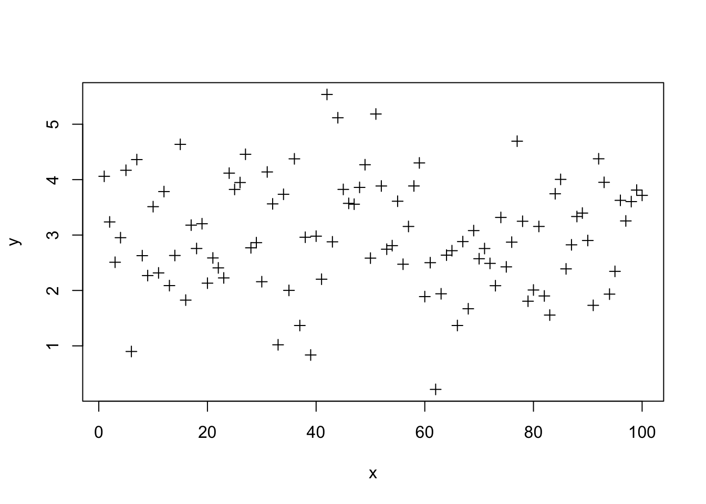
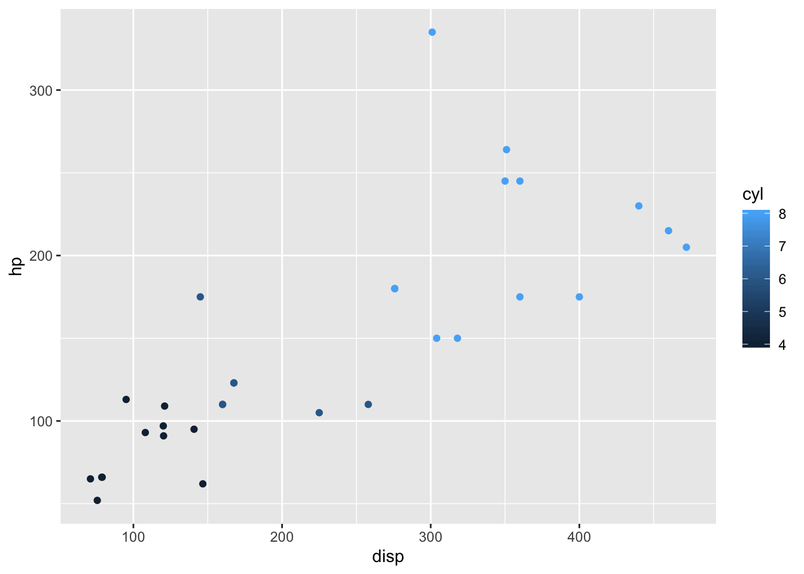
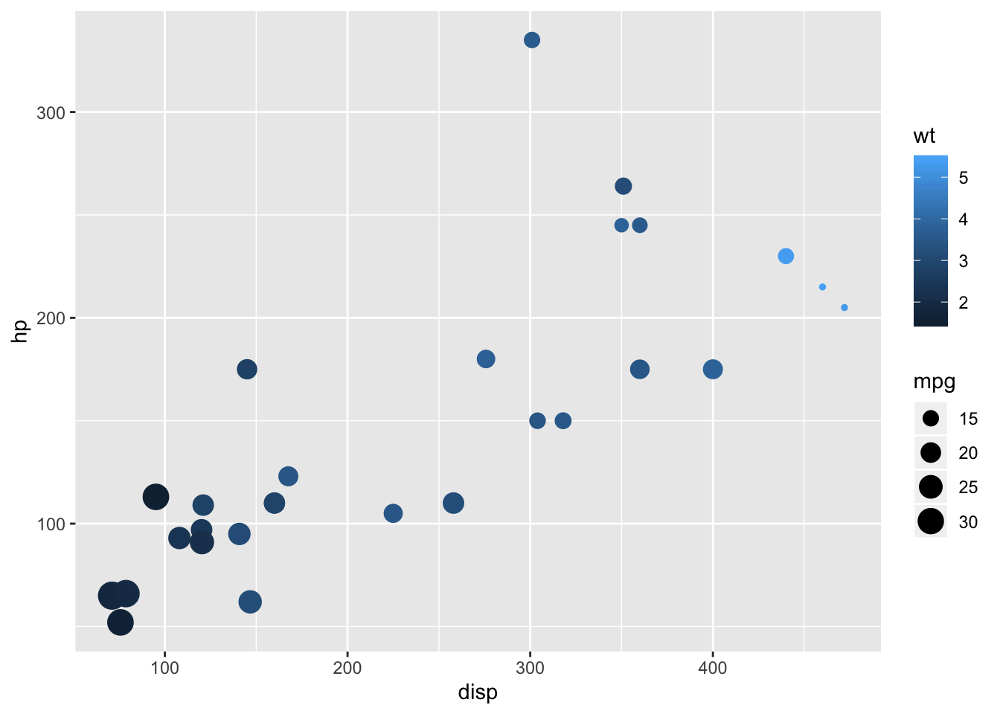

---
title: ''
---
# Plotting and Graphics

Visit these sites for some ideas.

-  http://www.sr.bham.ac.uk/~ajrs/R/r-gallery.html
-  http://gallery.r-enthusiasts.com/
-  http://cran.r-project.org/web/views/Graphics.html


## Base R graphics

The command `plot(x,y)` will plot vector x as the independent
variable and vector y as the dependent variable. Within the command
line, you can specify the title of the graph, the name of the x-axis,
and the name of the y-axis. 
    -   main=’title’
    -   xlab=’name of x axis’
    -   ylab=’name of y axis’

The command `lines(x,y)` adds a line segment to an existing plot. The
command `points(x,y)` adds points to the plot. A legend can be created
using `legend`, though getting the legend right for base graphics can
be a bit challenging. To get a basic idea of what R offers, it has a
build-in demo that can be run with `demo(graphics)`.

Try this yourself:


```r
x = 1:100
y = rnorm(100,3,1) # 100 random normal deviates with mean=3, sd=1
plot(x,y)
```


```r
plot(x,y,main='My First Plot')
```




```r
# change point type
plot(x,y,pch=3)
```


```r
# change color
plot(x,y,pch=4,col=2)
# draw lines between points
lines(x,y,col=3)
```


```r
z=sort(y)
# plot a sorted variable vs x
plot(x,z,main='Random Normal Numbers',
     xlab='Index',ylab='Random Number')
```


```r
# A basic histogram
hist(z, main="Histogram",
     sub="Random normal")


# A "density" plot
plot(density(z), main="Density plot",
     sub="Random normal")


# A smaller "bandwidth" to capture more detail
plot(density(z, adjust=0.5),
     sub="smaller bandwidth")
```


## Plotting with ggplot2

The `ggplot2` package is a relatively novel approach to generating highly informative publication-quality graphics. The "gg" stands for "Grammar of Graphics". In short, instead of thinking about a single function that produces a plot, `ggplot2` uses a "grammar" approach, akin to building more and more complex sentences to layer on more information or nuance. See the [ggplot2 graphics gallery](http://www.r-graph-gallery.com/portfolio/ggplot2-package/) for some examples _with accompanying code_.

The `ggplot2` package assumes that data are in the form of a data.frame. In some cases, the data will need to be manipulated into a form that matches assumptions that `ggplot2` uses.  In particular, if one has a *matrix* of numbers associated with different subjects (samples, people, etc.), the data will usually need to be transformed into a "long" data frame. 

To use the `ggplot2` package, it must be installed and loaded. Assuming that installation has been done already, we can load the package directly:


```r
library(ggplot2)
```

### mtcars data

We are going to use the mtcars dataset, included with R, to experiment with `ggplot2`.  


```r
data(mtcars)
```

- Exercise: Explore the `mtcars` dataset using `View`, `summary`, `dim`, `class`, etc.

We can also take a quick look at the relationships between the variables using the `pairs` plotting function.


```r
pairs(mtcars)
```

That is a useful view of the data. We want to use `ggplot2` to make an
informative plot, so let's approach this in a piecewise fashion.  We
first need to decide what type of plot to produce and what our basic
variables will be.  In this case, we have a number of choices.


```r
ggplot(mtcars,aes(x=disp,y=hp))
```

First, a little explanation is necessary.  The `ggplot` function takes
as its first argument a `data.frame`.  The second argument is the
"aesthetic", `aes`.  The `x` and `y` take column names from the
`mtcars` `data.frame` and will form the basis of our scatter plot.

But why did we get that "Error: No layers in plot"? Remember that
*ggplot2* is a "grammar of graphics". We supplied a subject, but no
verb (called a *layer* by ggplot2). So, to generate a plot, we need to
supply a verb.  There are many possibilities. Each "verb" or *layer*
typically starts with "geom" and then a descriptor. An example is
necessary.


```r
ggplot(mtcars,aes(x=disp,y=hp)) + geom_point()
```


We finally produced a plot. The power of *ggplot2*, though, is the
ability to make very rich plots by adding "grammar" to the "plot
sentence". We have a number of other variables in our `mtcars`
`data.frame`. How can we add another value to a two-dimensional plot?


```r
ggplot(mtcars,aes(x=disp,y=hp,color=cyl)) + geom_point()
```



The color of the points is a based on the numeric variable `wt`, the weight of the car. Can we do more? We can change the size of the points, also.


```r
ggplot(mtcars,aes(x=disp,y=hp,color=wt,size=mpg)) + geom_point()
```



So, on our 2D plot, we are now plotting four variables.  Can we do
more? We can manipulate the shape of the points in addition to the
color and the size.


```r
ggplot(mtcars,aes(x=disp,y=hp)) + geom_point(aes(size=mpg,color=wt,shape=cyl))
```

Why did we get that error? Ggplot2 is trying to be helpful by telling
us that a "continuous varialbe cannot be mapped to 'shape'". Well, in
our `mtcars` `data.frame`, we can look at `cyl` in detail.


```r
class(mtcars$cyl)
## [1] "numeric"
summary(mtcars$cyl)
##    Min. 1st Qu.  Median    Mean 3rd Qu.    Max. 
##    4.00    4.00    6.00    6.19    8.00    8.00
table(mtcars$cyl)
## 
##  4  6  8 
## 11  7 14
```

The `cyl` variable is "kinda" continuous in that it is numeric, but it
could also be thought of as a "category" of engines. R has a specific
data type for "category" data, called a *factor*. We can easily
convert the `cyl` column to a factor like so:


```r
mtcars$cyl = as.factor(mtcars$cyl)
```

Now, we can go ahead with our previous approach to make a
2-dimensional plot that displays the relationships between *five*
variables.


```r
ggplot(mtcars,aes(x=disp,y=hp)) + geom_point(aes(size=mpg,color=wt,shape=cyl))
```


- *Additional exercises*
    - Use `geom_text` to add labels to your plot.
    - Convert all your work to [plotly](https://plot.ly/ggplot2/) for interactive versions of the plots.


### NYC Flight data

I leave this section open-ended for you to explore further options
with the *ggplot2* package.  The data represent the on-time data for
all flights that departed New York City in 2013.


```r
# install.packages('nycflights13')
library(nycflights13)
data(flights)
head(flights)
## # A tibble: 6 x 19
##    year month   day dep_time sched_dep_time dep_delay arr_time
##   <int> <int> <int>    <int>          <int>     <dbl>    <int>
## 1  2013     1     1      517            515         2      830
## 2  2013     1     1      533            529         4      850
## 3  2013     1     1      542            540         2      923
## 4  2013     1     1      544            545        -1     1004
## 5  2013     1     1      554            600        -6      812
## 6  2013     1     1      554            558        -4      740
## # ... with 12 more variables: sched_arr_time <int>, arr_delay <dbl>,
## #   carrier <chr>, flight <int>, tailnum <chr>, origin <chr>, dest <chr>,
## #   air_time <dbl>, distance <dbl>, hour <dbl>, minute <dbl>,
## #   time_hour <dttm>
```

Use ggplot and other plotting tools to explore the data and look for
features that might contribute to airport delays. Consider using other
"geoms" during your exploration.


## Graphics Devices and Saving Plots

To make a plot directly to a file use: `png()`, `postscript()`,
    etc.


```r
png(file="myplot.png",width=480,height=480)
plot(density(z,adjust=2.0),sub="larger bandwidth")
dev.off()
## png 
##   2
```

On your own, save a pdf to a file. NOTE: The dimensions in `pdf()` are in *inches*.

To put multiple plots on a page, we can set the `mfrow` graphics
parameter.


```r
par(mfrow=c(2,1))
plot(density(z,adjust=2.0),sub="larger bandwidth")
hist(z)
```


        # use dev.off() to turn off the two-row plotting
R can have multiple graphics “devices” open.

-   To see a list of active devices: `dev.list()`
-   To close the most recent device: `dev.off()`
-   To close device 5: `dev.off(5)`
-   To use device 5: `dev.set(5)`


