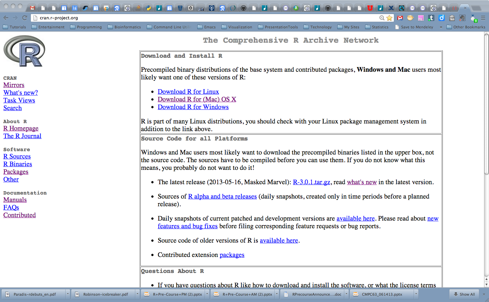

# R Mechanics

## Installing R

The home page for R is called the Comprehensive R Archive Network (CRAN). The [website](http://cran.r-project.or) is not pretty (see figure \@ref(fig:cranscreenshot)), but it has quite a bit of information on it. It is not the best place to find help on R, although it is one of the best places to get R-related software, tools, and updates.


```r

```

<div class="figure">

<p class="caption">(\#fig:cranscreenshot)The Comprehensive R Archive Network (CRAN) website</p>
</div>

Detailed installation instructions are readily available, but here are abbreviated instructions for convenience.

### Windows

NOTE: See [Windows installation instructions][Windows] for more
detail. Install _R_ and _RStudio_ as regular users.

To install _R_, visit the [Windows base][] distribution page. Click on
the `Download R-3.4.0 for Windows` link (or use the latest version available). Click on the installer and
make the default selection for each option.

To install _RStudio_, visit the [RStudio download][] page. Click on
the current RStudio release for Windows link. Click on the installer
and follow default instructions.

### Mac

NOTE: See [R for Mac OS X][MacOS] for more detail.

To install _R_, visit the [R for Mac OS X][MacOS]. Click on the the
`R-3.4.0.pkg` link (or use the latest version available). Click on the installer and follow default
instructions.

To install _RStudio_, visit the [RStudio download][] page. Click on
the current RStudio release for Windows link. Click on the installer
and follow default instructions.

### Linux

NOTE: See [distribution-specific instructions][Linux-distro] for
additional detail.

On debian-based systems, the easiest way to install _R_ is through a
package manager manager, run under an administrator account.  On Linux
one usually needs to install _R_ packages from source, and _R_ package
source often contains C, C++, or Fortran code requiring a compiler and
`-dev` versions of various system libraries. It is therefore
convenient to install the `-dev` version of R.

```
sudo apt-get install r-base r-base-dev
```

When installing source packages, it may be necessary to have access to
the `-dev` version of various system libraries. Many of these are
installed as dependencies of `r-base-dev`; other common examples
include the xml and curl libraries

```
sudo apt-get install libxml2-dev
sudo apt-get install libcurl-dev
```

Note in particular the use specification of libraries (the `lib`
prefix) and the use of the `-dev` version.

To install _RStudio_, visit the [RStudio download][] page. Download
the appropriate archive for your OS. On Ubuntu, install the `.deb`
installer with

```
sudo dpkg -i rstudio-1.0.136-amd64.deb
```

[Windows]: https://cran.r-project.org/bin/windows/
[Windows base]: https://cran.r-project.org/bin/windows/base/
[MacOS]: https://cran.r-project.org/bin/macosx/
[RStudio download]: https://www.rstudio.com/products/rstudio/download/

[Rtools]: https://cran.r-project.org/bin/windows/Rtools/
[Linux-distro]: https://cran.r-project.org/bin/linux/
[R-admin]: https://cran.r-project.org/doc/manuals/r-release/R-admin.html)

## Starting R

How to start R depends a bit on the operating system (Mac, Windows, Linux) and interface.  In this course, we will largely be using an Integrated Development Environment (IDE) called *RStudio*, but there is nothing to prohibit using R at the command line or in some other interface (and there are a few). A screenshot of the interface is shown in figure \@ref(fig:rstudiointerface).

<div class="figure">

<p class="caption">(\#fig:rstudiointerface)The Rstudio interface</p>
</div>

# First steps

## Interacting with R

The only meaningful way of interacting with R is by typing into the R console. At the most basic level, anything that we type at the command line will fall into one of two categories:

1. Assignments
    
    
    ```r
    x = 1
    y <- 2
    ```
    
2. Expressions

    
    ```r
    1 + pi + sin(42)
    ```
    
    ```
    ## [1] 3.225071
    ```

The assignment type is obvious because either the The “<-” or “=” are used. Note that when we type expressions, R will return a result.  In this case, the result of R evaluating `1 + pi + sin(42)` is `3.2250711`.

The standard R prompt is a ">" sign. When present, R is waiting for the next expression or assignment.  If a line is not a complete R command, R will continue the next line with a "+". For example, typing the fillowing with a "Return" after the second "+" will result in R giving back a "+" on the next line, a prompt to keep typing.


```r
1 + pi +
sin(3.7)
```

```
## [1] 3.611757
```

## Rules for Names in R

R allows users to assign names to objects such as variables, functions, and even dimensions of data. However, these names must follow a few rules.

- Names may contain any combination of letters, numbers, underscore, and "."
- Names may not start with numbers, underscore.
- R names are case-sensitive.

Examples of valid R names include:

```
pi
x
camelCaps
my_stuff
MY_Stuff
this.is.the.name.of.the.man
ABC123
abc1234asdf
.hi
```

## Resources for Getting Help

There is extensive built-in help and documentation within R. 

If the name of the function or object on which help is sought is known, the following approaches with the name of the function or object will be helpful. For a concrete example, examine the help for the `print` method.


```r
help(print)
help('print')
?print
```

If the name of the function or object on which help is sought is *not* known, the following from within R will be helpful. 


```r
help.search('microarray')
RSiteSearch('microarray')
```

There are also tons of online resources that Google will include in searches if online searching feels more appropriate.

I strongly recommend using `help(newfunction)` for all
functions that are new or unfamiliar to you.

# Introduction to R data structures

As in many programming languages, understanding how data are stored and manipulated is important to getting the most out of the experience. In these next few sections, we will introduce some basic R data types and structures as well as some general approaches for working with them.

## Vectors

In R, even a single value is a vector with length=1. 


```r
z = 1
z
```

```
## [1] 1
```

```r
length(z)
```

```
## [1] 1
```

In the code above, we "assigned" the value 1 to the variable named `z`. Typing `z` by itself is an "expression" that returns a result which is, in this case, the value that we just assigned. The `length` method takes an R object and returns the R length. There are numerous ways of asking R about what an object represents, and `length` is one of them.

Vectors can contain numbers, strings (character data), or logical values (`TRUE` and `FALSE`) or other "atomic" data types (table \@ref(tab:simpletypes)). *Vectors cannot contain a mix of types!* We will introduce another data structure, the R `list` for situations when we need to store a mix of base R data types. 

Table: (\#tab:simpletypes) Atomic (simplest) data types in R.

  Data type   Stores
  ----------- ------------------------
    numeric      floating point numbers
    integer           integers
    complex       complex numbers
    factor        categorical data
   character          strings
    logical        TRUE or FALSE
      NA              missing
     NULL              empty
   function        function type

### Creating vectors

Character vectors (also sometimes called "string" vectors) are entered with each value
surrounded by single or double quotes; either is acceptable, but they
must match. They are always displayed by R with double quotes. Here are some examples of creating vectors:


```r
# examples of vectors
c('hello','world')
```

```
## [1] "hello" "world"
```

```r
c(1,3,4,5,1,2)
```

```
## [1] 1 3 4 5 1 2
```

```r
c(1.12341e7,78234.126)
```

```
## [1] 11234100.00    78234.13
```

```r
c(TRUE,FALSE,TRUE,TRUE)
```

```
## [1]  TRUE FALSE  TRUE  TRUE
```

```r
# note how in the next case the TRUE is converted to "TRUE"
# with quotes around it.
c(TRUE,'hello')
```

```
## [1] "TRUE"  "hello"
```

We can also create vectors as "regular sequences" of numbers. For example:


```r
# create a vector of integers from 1 to 10
x = 1:10
# and backwards
x = 10:1
```

The `seq` function can create more flexible regular sequences. 
  

```r
# create a vector of numbers from 1 to 4 skipping by 0.3
y = seq(1,4,0.3)
```


And creating a new vector by concatenating existing vectors is possible, as well.


```r
# create a sequence by concatenating two other sequences
z = c(y,x)
z
```

```
##  [1]  1.0  1.3  1.6  1.9  2.2  2.5  2.8  3.1  3.4  3.7  4.0 10.0  9.0  8.0
## [15]  7.0  6.0  5.0  4.0  3.0  2.0  1.0
```

### Vector Operations

Operations on a single vector are typically done element-by-element. For example, we can add `2` to a vector, `2` is added to each element of the vector and a new vector of the same length is returned.


```r
x = 1:10
x + 2
```

```
##  [1]  3  4  5  6  7  8  9 10 11 12
```

If the operation involves two vectors, the following rules apply. If the vectors are the same length: R simply applies the operation to each pair of elements.


```r
x + x
```

```
##  [1]  2  4  6  8 10 12 14 16 18 20
```

If the vectors are different lengths, but one length a multiple of the other, R
reuses the shorter vector as needed.


```r
x = 1:10
y = c(1,2)
x * y
```

```
##  [1]  1  4  3  8  5 12  7 16  9 20
```

If the vectors are different lengths, but one length *not* a multiple of the
other, R reuses the shorter vector as needed *and* delivers a
warning.


```r
x = 1:10
y = c(2,3,4)
x * y
```

```
## Warning in x * y: longer object length is not a multiple of shorter object
## length
```

```
##  [1]  2  6 12  8 15 24 14 24 36 20
```


Typical operations include multiplication ("\*"), addition,
subtraction, division, exponentiation ("\^"), but many operations
in R operate on vectors and are then called "vectorized".

### Logical Vectors

Logical vectors are vectors composed on only the values `TRUE` and
`FALSE`. Note the all-upper-case and no quotation marks.


```r
a = c(TRUE,FALSE,TRUE)

# we can also create a logical vector from a numeric vector
# 0 = false, everything else is 1
b = c(1,0,217)
d = as.logical(b)
d
```

```
## [1]  TRUE FALSE  TRUE
```

```r
# test if a and d are the same at every element
all.equal(a,d)
```

```
## [1] TRUE
```

```r
# We can also convert from logical to numeric
as.numeric(a)
```

```
## [1] 1 0 1
```

### Logical Operators

Some operators like `<, >, ==, >=, <=, !=` can be used to create logical
vectors.


```r
# create a numeric vector
x = 1:10
# testing whether x > 5 creates a logical vector
x > 5
```

```
##  [1] FALSE FALSE FALSE FALSE FALSE  TRUE  TRUE  TRUE  TRUE  TRUE
```

```r
x <= 5
```

```
##  [1]  TRUE  TRUE  TRUE  TRUE  TRUE FALSE FALSE FALSE FALSE FALSE
```

```r
x != 5
```

```
##  [1]  TRUE  TRUE  TRUE  TRUE FALSE  TRUE  TRUE  TRUE  TRUE  TRUE
```

```r
x == 5
```

```
##  [1] FALSE FALSE FALSE FALSE  TRUE FALSE FALSE FALSE FALSE FALSE
```

We can also assign the results to a variable:


```r
y = (x == 5)
y
```

```
##  [1] FALSE FALSE FALSE FALSE  TRUE FALSE FALSE FALSE FALSE FALSE
```


### Indexing Vectors

In R, an index is used to refer to a specific element or
set of elements in an vector (or other data structure). [R uses `[` and `]` to perform indexing,
although other approaches to getting subsets of larger data
structures are common in R.


```r
x = seq(0,1,0.1)
# create a new vector from the 4th element of x
x[4]
```

```
## [1] 0.3
```

We can even use other vectors to perform the "indexing".


```r
x[c(3,5,6)]
```

```
## [1] 0.2 0.4 0.5
```

```r
y = 3:6
x[y]
```

```
## [1] 0.2 0.3 0.4 0.5
```


Combining the concept of indexing with the concept of logical vectors
results in a very power combination.


```r
# use help('rnorm') to figure out what is happening next
myvec = rnorm(10)

# create logical vector that is TRUE where myvec is >0.25
gt1 = (myvec > 0.25)
sum(gt1)
```

```
## [1] 2
```

```r
# and use our logical vector to create a vector of myvec values that are >0.25
myvec[gt1]
```

```
## [1] 0.7607835 0.9884736
```

```r
# or <=0.25 using the logical "not" operator, "!"
myvec[!gt1]
```

```
## [1] -0.8477263  0.2293274 -0.2401294 -1.1820928 -0.3578377  0.1189934
## [7]  0.2245638 -1.6902806
```

```r
# shorter, one line approach
myvec[myvec > 0.25]
```

```
## [1] 0.7607835 0.9884736
```


### Character Vectors, A.K.A. Strings

R uses the `paste` function to concatenate strings.


```r
paste("abc","def")
```

```
## [1] "abc def"
```

```r
paste("abc","def",sep="THISSEP")
```

```
## [1] "abcTHISSEPdef"
```

```r
paste0("abc","def")
```

```
## [1] "abcdef"
```

```r
## [1] "abcdef"
paste(c("X","Y"),1:10)
```

```
##  [1] "X 1"  "Y 2"  "X 3"  "Y 4"  "X 5"  "Y 6"  "X 7"  "Y 8"  "X 9"  "Y 10"
```

```r
paste(c("X","Y"),1:10,sep="_")
```

```
##  [1] "X_1"  "Y_2"  "X_3"  "Y_4"  "X_5"  "Y_6"  "X_7"  "Y_8"  "X_9"  "Y_10"
```

We can count the number of characters in a string.


```r
nchar('abc')
```

```
## [1] 3
```

```r
nchar(c('abc','d',123456))
```

```
## [1] 3 1 6
```
        
Pulling out parts of strings is also sometimes useful.


```r
substr('This is a good sentence.',start=10,stop=15)
```

```
## [1] " good "
```

Another common operation is to replace something in a string with something (a find-and-replace).


```r
sub('This','That','This is a good sentence.')
```

```
## [1] "That is a good sentence."
```

When we want to find all strings that match some other string, we can use `grep`, or "grab regular expression".


```r
grep('bcd',c('abcdef','abcd','bcde','cdef','defg'))
```

```
## [1] 1 2 3
```

```r
grep('bcd',c('abcdef','abcd','bcde','cdef','defg'),value=TRUE)
```

```
## [1] "abcdef" "abcd"   "bcde"
```

### Missing Values, AKA “NA”

R has a special value, “NA”, that represents a “missing” value, or *Not Available*, in a
vector or other data structure. Here, we just create a vector to experiment.


```r
x = 1:5
x
```

```
## [1] 1 2 3 4 5
```

```r
length(x)
```

```
## [1] 5
```


```r
is.na(x)
```

```
## [1] FALSE FALSE FALSE FALSE FALSE
```

```r
x[2] = NA
x
```

```
## [1]  1 NA  3  4  5
```
The length of `x` is unchanged, but there is one value that is marked as "missing" by virtue of being `NA`.


```r
length(x)
```

```
## [1] 5
```

```r
is.na(x)
```

```
## [1] FALSE  TRUE FALSE FALSE FALSE
```

We can remove `NA` values by using indexing. In the following, `is.na(x)` returns a logical vector the
length of `x`. The `!` is the logical _NOT_ operator and converts `TRUE` to `FALSE` and vice-versa.


```r
x[!is.na(x)]
```

```
## [1] 1 3 4 5
```

### Factors

A factor is a special type of vector, normally used to hold a
categorical variable--such as smoker/nonsmoker, state of residency, zipcode--in many statistical functions. Such vectors have class “factor”. Factors are primarily used in Analysis of Variance (ANOVA) or other situations when "categories" are needed. When a factor is used as a predictor variable, the corresponding indicator variables are created (more later).

Note of caution that factors in R often *appear* to be character vectors
when printed, but you will notice that they do not have double quotes
around them. They are stored in R as numbers with a key name, so
sometimes you will note that the factor *behaves* like a numeric vector.


```r
# create the character vector
citizen<-c("uk","us","no","au","uk","us","us","no","au") 

# convert to factor
citizenf<-factor(citizen)                                
citizen             
```

```
## [1] "uk" "us" "no" "au" "uk" "us" "us" "no" "au"
```

```r
citizenf
```

```
## [1] uk us no au uk us us no au
## Levels: au no uk us
```

```r
# convert factor back to character vector
as.character(citizenf)
```

```
## [1] "uk" "us" "no" "au" "uk" "us" "us" "no" "au"
```

```r
# convert to numeric vector
as.numeric(citizenf)
```

```
## [1] 3 4 2 1 3 4 4 2 1
```

R stores many data structures as vectors with "attributes" and "class" (just so you have seen this).


```r
attributes(citizenf)
```

```
## $levels
## [1] "au" "no" "uk" "us"
## 
## $class
## [1] "factor"
```

```r
class(citizenf)
```

```
## [1] "factor"
```

```r
# note that after unclassing, we can see the 
# underlying numeric structure again
unclass(citizenf)
```

```
## [1] 3 4 2 1 3 4 4 2 1
## attr(,"levels")
## [1] "au" "no" "uk" "us"
```

Tabulating factors is a useful way to get a sense of the "sample" set available. 


```r
table(citizenf)
```

```
## citizenf
## au no uk us 
##  2  2  2  3
```


## Rectangular Data


A _matrix_ is a rectangular collection of the same data type. It can be viewed as a collection
of column vectors all of the same length and the same type (i.e. numeric, character or logical). A _data.frame_ is *also* a rectangular array. All of the columns must be the same length, but they may be of *different* types. The rows and columns of a matrix or data frame can be given names. However these are implemented differently in R; many operations will work for one but not both, often a source of confusion.

### Matrices


We start by building a matrix from parts:


```r
x <- 1:10 
y <- rnorm(10)

# make a matrix by column binding two numeric vectors
mat<-cbind(x,y)
mat
```

```
##        x           y
##  [1,]  1 -1.68496497
##  [2,]  2 -1.03115391
##  [3,]  3  1.88753426
##  [4,]  4 -0.03496469
##  [5,]  5  0.59148366
##  [6,]  6  1.10860338
##  [7,]  7  0.88909611
##  [8,]  8  0.41626723
##  [9,]  9 -1.53670477
## [10,] 10  0.39940732
```

Inspecting the names associated with rows and columns is often useful, particularly if the names have human meaning. 


```r
rownames(mat)
```

```
## NULL
```

```r
colnames(mat)
```

```
## [1] "x" "y"
```

Matrices have dimensions.


```r
dim(mat)
```

```
## [1] 10  2
```

```r
nrow(mat)
```

```
## [1] 10
```

```r
ncol(mat)
```

```
## [1] 2
```

Indexing for matrices works as for vectors except that we now need to
include both the row and column (in that order).


```r
# The 2nd element of the 1st row of mat
mat[1,2]
```

```
##         y 
## -1.684965
```

```r
# The first ROW of mat
mat[1,]
```

```
##         x         y 
##  1.000000 -1.684965
```

```r
# The first COLUMN of mat
mat[,1]
```

```
##  [1]  1  2  3  4  5  6  7  8  9 10
```

```r
# and all elements of mat that are > 4; note no comma
mat[mat>4]
```

```
## [1]  5  6  7  8  9 10
```

```r
## [1]  5  6  7  8  9 10
```

Note that in the last case, there is no ",", so R treats the matrix as a long vector (length=20). This is convenient, sometimes, but it can also be a source of error, as some code may "work" but be doing something unexpected.

In the next example, we create a matrix with 2 columns and 10 rows.


```r
m = matrix(rnorm(20),nrow=10)
# multiply all values in the matrix by 20
m = m*20
# and add 100 to the first column of m
m[,1] = m[,1] + 100
# summarize m
summary(m)
```

```
##        V1               V2         
##  Min.   : 58.74   Min.   :-51.188  
##  1st Qu.: 77.28   1st Qu.:-10.260  
##  Median : 83.04   Median : -2.839  
##  Mean   : 84.11   Mean   : -2.804  
##  3rd Qu.: 94.88   3rd Qu.: 14.528  
##  Max.   :108.73   Max.   : 28.102
```

### Data Frames

#### Matrices Versus Data Frames


```r
mat<-cbind(x,y)
head(mat)
```

```
##      x           y
## [1,] 1 -1.68496497
## [2,] 2 -1.03115391
## [3,] 3  1.88753426
## [4,] 4 -0.03496469
## [5,] 5  0.59148366
## [6,] 6  1.10860338
```

```r
class(mat[,1])          
```

```
## [1] "numeric"
```

```r
z = paste0('a',1:10)
tab<-cbind(x,y,z)
class(tab)
```

```
## [1] "matrix"
```

```r
mode(tab[,1])
```

```
## [1] "character"
```

```r
head(tab,4)
```

```
##      x   y                     z   
## [1,] "1" "-1.68496496696929"   "a1"
## [2,] "2" "-1.03115391149805"   "a2"
## [3,] "3" "1.88753426456481"    "a3"
## [4,] "4" "-0.0349646906710302" "a4"
```


```r
tab<-data.frame(x,y,z)
class(tab)
```

```
## [1] "data.frame"
```

```r
head(tab)
```

```
##   x           y  z
## 1 1 -1.68496497 a1
## 2 2 -1.03115391 a2
## 3 3  1.88753426 a3
## 4 4 -0.03496469 a4
## 5 5  0.59148366 a5
## 6 6  1.10860338 a6
```

```r
mode(tab[,1])
```

```
## [1] "numeric"
```

```r
class(tab[,3])
```

```
## [1] "factor"
```

```r
rownames(tab)           
```

```
##  [1] "1"  "2"  "3"  "4"  "5"  "6"  "7"  "8"  "9"  "10"
```

```r
rownames(tab)<-paste0("row",1:10)
rownames(tab)
```

```
##  [1] "row1"  "row2"  "row3"  "row4"  "row5"  "row6"  "row7"  "row8" 
##  [9] "row9"  "row10"
```


Data frame columns can be refered to by name using the "dollar sign" operator.


```r
head(tab)
```

```
##      x           y  z
## row1 1 -1.68496497 a1
## row2 2 -1.03115391 a2
## row3 3  1.88753426 a3
## row4 4 -0.03496469 a4
## row5 5  0.59148366 a5
## row6 6  1.10860338 a6
```

```r
tab$x
```

```
##  [1]  1  2  3  4  5  6  7  8  9 10
```

```r
tab$y
```

```
##  [1] -1.68496497 -1.03115391  1.88753426 -0.03496469  0.59148366
##  [6]  1.10860338  0.88909611  0.41626723 -1.53670477  0.39940732
```

Column names can be set, which can be useful for referring to data
later.


```r
colnames(tab)
```

```
## [1] "x" "y" "z"
```

```r
colnames(tab) = paste0('col',1:3)
```

Data frames have functions to report size and even `summary` functions. Try the following:


```r
ncol(tab)
```

```
## [1] 3
```

```r
nrow(tab)
```

```
## [1] 10
```

```r
dim(tab)
```

```
## [1] 10  3
```

```r
summary(tab)
```

```
##       col1            col2              col3  
##  Min.   : 1.00   Min.   :-1.6850   a1     :1  
##  1st Qu.: 3.25   1st Qu.:-0.7821   a10    :1  
##  Median : 5.50   Median : 0.4078   a2     :1  
##  Mean   : 5.50   Mean   : 0.1005   a3     :1  
##  3rd Qu.: 7.75   3rd Qu.: 0.8147   a4     :1  
##  Max.   :10.00   Max.   : 1.8875   a5     :1  
##                                    (Other):4
```

Extracting parts of a `data.frame` work as for matrices. Try to think about what each of the following will do before asking R to evaluate the result. 

```r
tab[1:3,]
```

```
##      col1      col2 col3
## row1    1 -1.684965   a1
## row2    2 -1.031154   a2
## row3    3  1.887534   a3
```

```r
tab[,2:3]
```

```
##              col2 col3
## row1  -1.68496497   a1
## row2  -1.03115391   a2
## row3   1.88753426   a3
## row4  -0.03496469   a4
## row5   0.59148366   a5
## row6   1.10860338   a6
## row7   0.88909611   a7
## row8   0.41626723   a8
## row9  -1.53670477   a9
## row10  0.39940732  a10
```

```r
tab[,1]>7
```

```
##  [1] FALSE FALSE FALSE FALSE FALSE FALSE FALSE  TRUE  TRUE  TRUE
```

```r
tab[tab[,1]>7,]
```

```
##       col1       col2 col3
## row8     8  0.4162672   a8
## row9     9 -1.5367048   a9
## row10   10  0.3994073  a10
```

```r
tab[tab[,1]>7,3]
```

```
## [1] a8  a9  a10
## Levels: a1 a10 a2 a3 a4 a5 a6 a7 a8 a9
```

```r
tab[tab[,1]>7,2:3]
```

```
##             col2 col3
## row8   0.4162672   a8
## row9  -1.5367048   a9
## row10  0.3994073  a10
```

```r
tab[tab$x>7,3]
```

```
## factor(0)
## Levels: a1 a10 a2 a3 a4 a5 a6 a7 a8 a9
```

```r
tab$z[tab$x>3]
```

```
## NULL
```

## Lists and Objects

A list is a collection of objects that may be the same or different
types. The objects in a list often have names, and may be indexed either by name
(e.g. `my_list$name3`) or component number (e.g. `my_list[[3]]`). 
As an aside, a data frame is a list of matched column vectors.

We can reate a list, noting the different data types involved.


```r
a = list(1,"b",c(1,2,3))
a
```

```
## [[1]]
## [1] 1
## 
## [[2]]
## [1] "b"
## 
## [[3]]
## [1] 1 2 3
```

```r
length(a)
```

```
## [1] 3
```

```r
class(a)
```

```
## [1] "list"
```

```r
a[[3]]
```

```
## [1] 1 2 3
```

A data frame *is* a list.


```r
# test if our friend "tab" is a list
is.list(tab)
```

```
## [1] TRUE
```

```r
tab[[2]]
```

```
##  [1] -1.68496497 -1.03115391  1.88753426 -0.03496469  0.59148366
##  [6]  1.10860338  0.88909611  0.41626723 -1.53670477  0.39940732
```

```r
names(tab)
```

```
## [1] "col1" "col2" "col3"
```

Table (\#tab:datatypes) Summary of basic R data structures.

  Data type   Stores
  ------------ ----------------------------------------------------------
     vector              one-dimensional data, single data type
     matrix              two-dimensional data, single data type
   data frame          two-dimensional data, multiple data types
      list        list of data types, not all need to be the same type
     object     a list with attributes and potentially slots and methods

