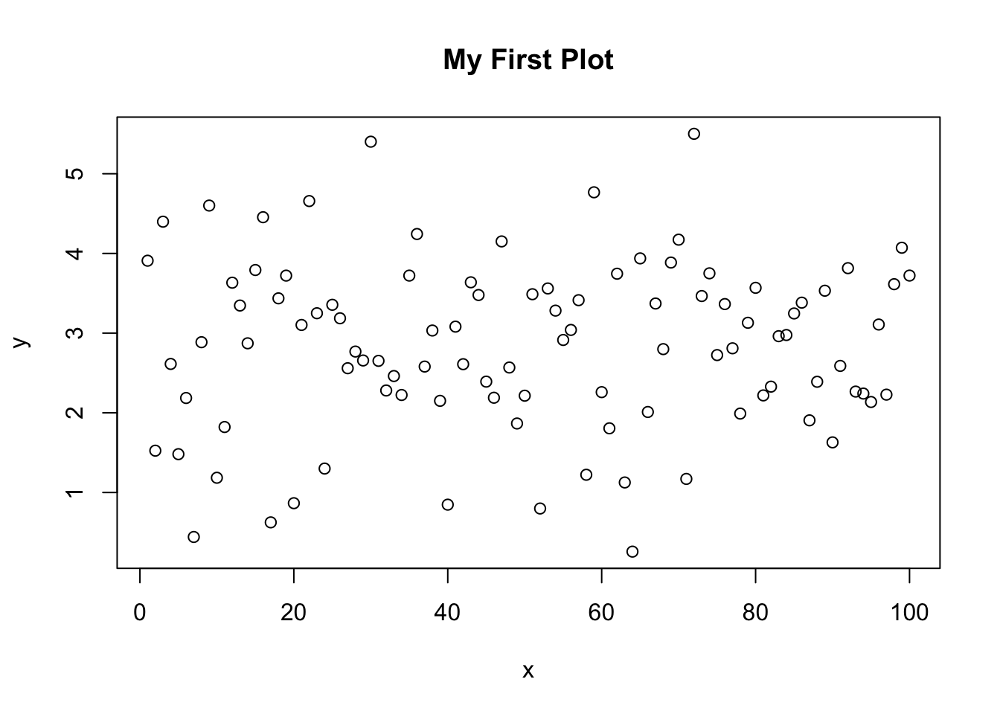
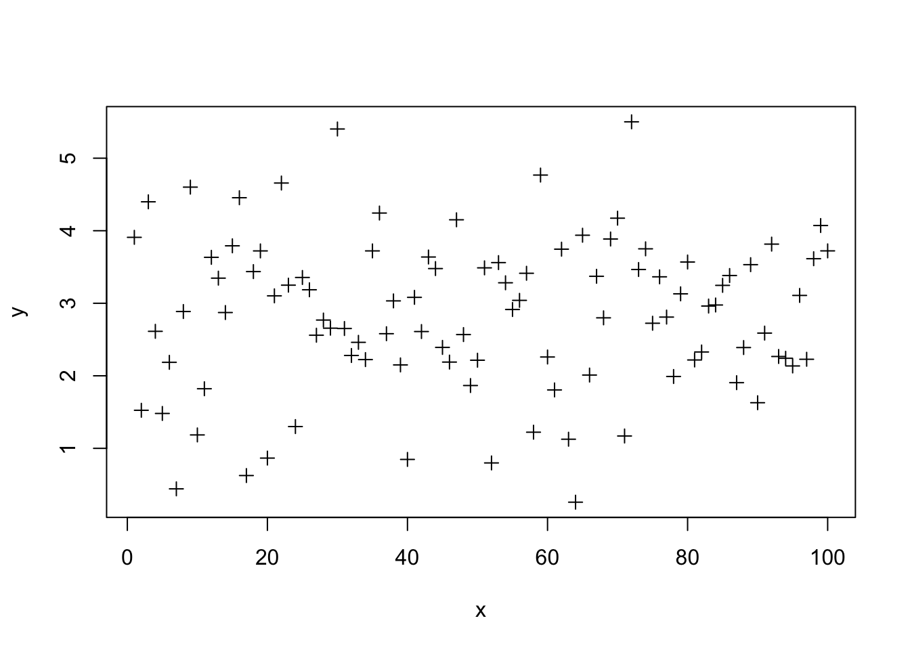
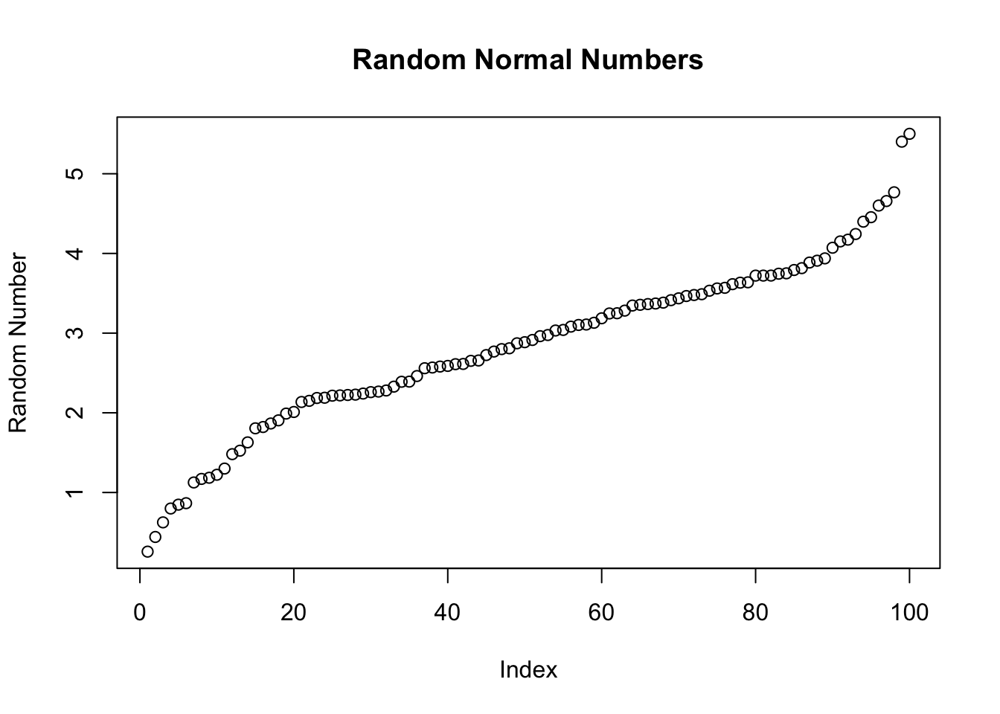
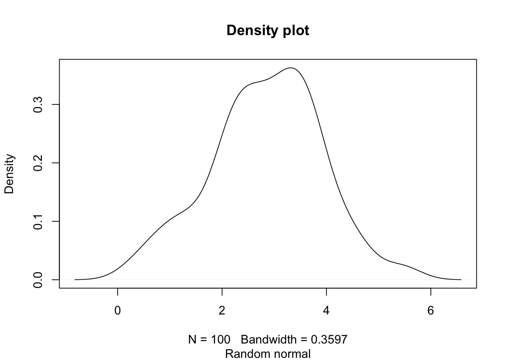

# Plotting and Graphics

Visit these sites for some ideas.

-  http://www.sr.bham.ac.uk/~ajrs/R/r-gallery.html
-  http://gallery.r-enthusiasts.com/
-  http://cran.r-project.org/web/views/Graphics.html


## Basic Plot Functions

The command `plot(x,y)` will plot vector x as the independent
variable and vector y as the dependent variable. Within the command
line, you can specify the title of the graph, the name of the x-axis,
and the name of the y-axis. 
    -   main=’title’
    -   xlab=’name of x axis’
    -   ylab=’name of y axis’

The command `lines(x,y)` adds a line segment to an existing plot. The
command `points(x,y)` adds points to the plot. A legend can be created
using `legend`, though getting the legend right for base graphics can
be a bit challenging. To get a basic idea of what R offers, it has a
build-in demo that can be run with `demo(graphics)`.

### Simple Plotting Example

Try this yourself:


```r
x = 1:100
y = rnorm(100,3,1) # 100 random normal deviates with mean=3, sd=1
plot(x,y)
```


```r
plot(x,y,main='My First Plot')
```




```r
# change point type
plot(x,y,pch=3)
```




```r
# change color
plot(x,y,pch=4,col=2)
# draw lines between points
lines(x,y,col=3)
```


```r
z=sort(y)
# plot a sorted variable vs x
plot(x,z,main='Random Normal Numbers',
     xlab='Index',ylab='Random Number')
```




```r
# A basic histogram
hist(z, main="Histogram",
     sub="Random normal")
```


```r
# A "density" plot
plot(density(z), main="Density plot",
     sub="Random normal")
```



```r
# A smaller "bandwidth" to capture more detail
plot(density(z, adjust=0.5),
     sub="smaller bandwidth")
```


### Graphics Devices and Saving Plots

To make a plot directly to a file use: `png()`, `postscript()`,
    etc.


```r
png(file="myplot.png",width=480,height=480)
plot(density(z,adjust=2.0),sub="larger bandwidth")
dev.off()
```

```
## quartz_off_screen 
##                 2
```

On your own, save a pdf to a file. NOTE: The dimensions in `pdf()` are in *inches*.

To put multiple plots on a page, we can set the `mfrow` graphics
parameter.


```r
par(mfrow=c(2,1))
plot(density(z,adjust=2.0),sub="larger bandwidth")
hist(z)
```


        # use dev.off() to turn off the two-row plotting
R can have multiple graphics “devices” open.

-   To see a list of active devices: `dev.list()`
-   To close the most recent device: `dev.off()`
-   To close device 5: `dev.off(5)`
-   To use device 5: `dev.set(5)`

        
