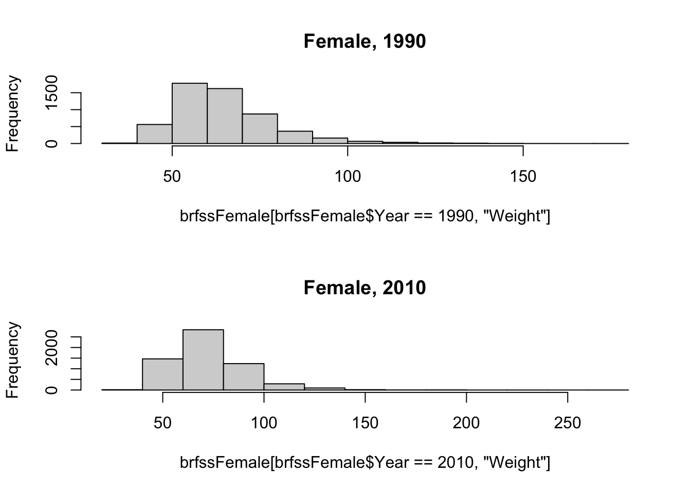
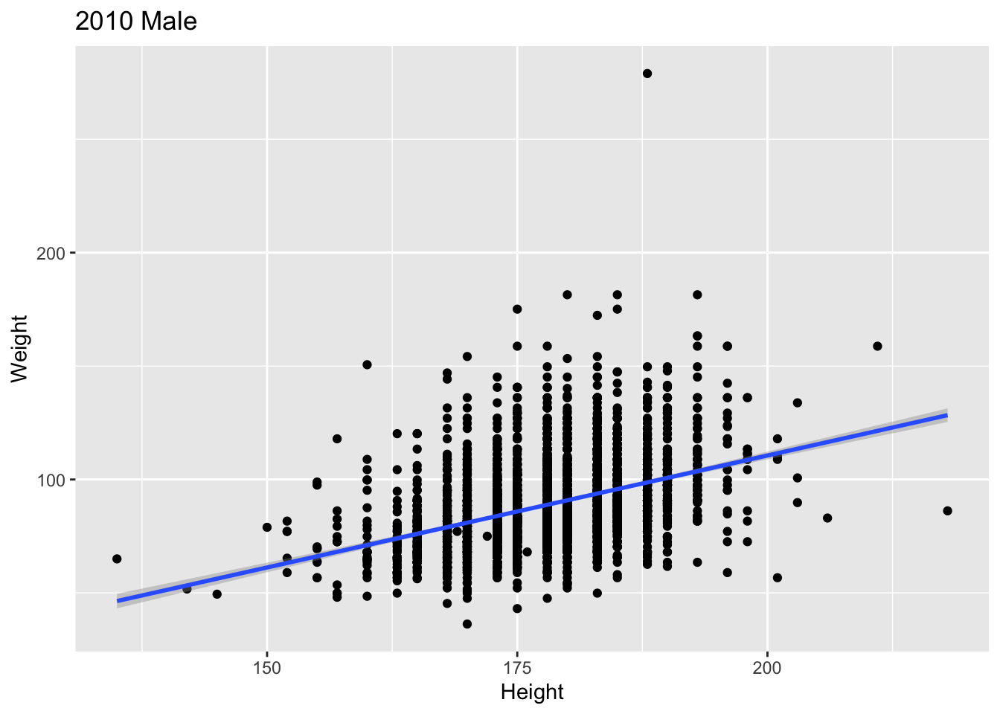
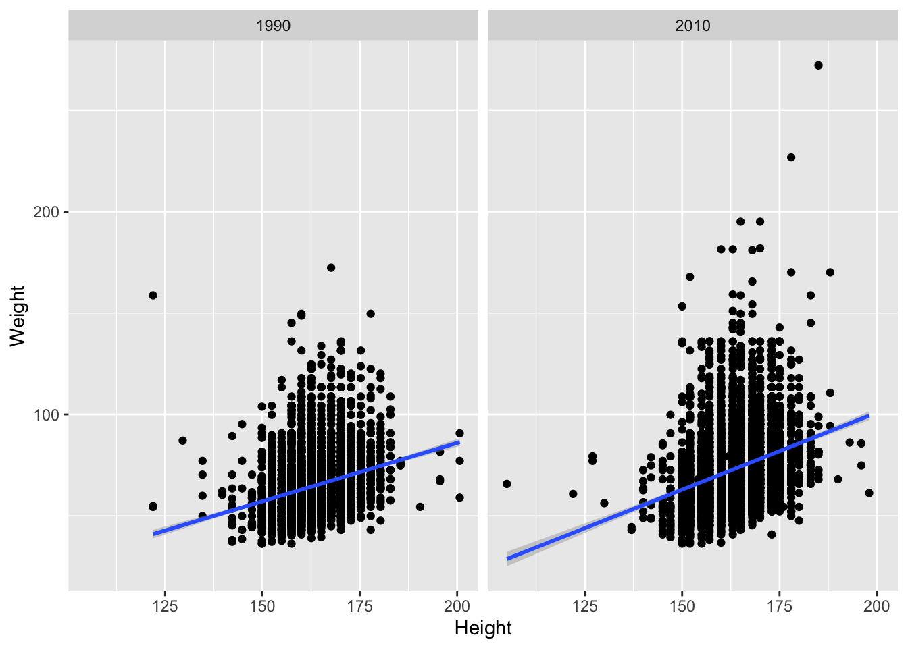
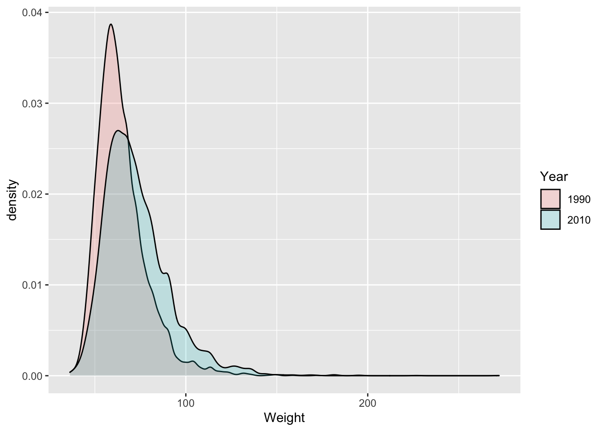

---
title: "R Work Flows and Data Visualization"
author: "Martin Morgan <Martin.Morgan@RoswellPark.org> & Sean Davis <seandavi@gmail.com>"
vignette: >
  % \VignetteIndexEntry{A.4 -- R Workflows and Data Visualization}
  % \VignetteEngine{knitr::rmarkdown}
---


# Using _R_ in real life

## Organizing work

Usually, work is organized into a directory with:

- A folder containing _R_ scripts (`scripts/BRFSS-visualize.R`)
- 'External' data like the csv files that we've been working with,
  usually in a separate folder (`extdata/BRFSS-subset.csv`)
- (sometimes) _R_ objects written to disk using `saveRDS()` (`.rds`
  files) that represent final results or intermediate 'checkpoints'
  (`extdata/ALL-cleaned.rds`). Read the data into an _R_ session using
  `readRDS()`.
- Use `setwd()` to navigate to folder containing scripts/, extdata/ folder
- Source an entire script with `source("scripts/BRFSS-visualization.R")`.
  
_R_ can also save the state of the current session (prompt when
choosing to `quit()` _R_), and to view and save the `history()` of the
the current session; I do not find these to be helpful in my own work
flows.

## _R_ Packages

All the functionality we have been using comes from _packages_
that are automatically _loaded_ when _R_ starts. Loaded packages are on
the `search()` path.


```r
search()
## [1] ".GlobalEnv"        "package:stats"     "package:graphics" 
## [4] "package:grDevices" "package:utils"     "package:datasets" 
## [7] "package:methods"   "Autoloads"         "package:base"
```

Additional packages may be _installed_ in _R_'s libraries. Use
`installed.packages() or the _RStudio_ interface to see installed
packages. To use these packages, it is necessary to attach them to the
search path, e.g., for survival analysis


```r
library("survival")
```

There are many thousands of _R_ packages, and not all of them are
installed in a single installation. Important repositories are

- CRAN: https://cran.r-project.org/
- Bioconductor: https://bioconductor.org/packages

Packages can be discovered in various ways, including
[CRAN Task Views][] and the [_Bioconductor_ web][] and
[_Bioconductor_ support][] sites.

To install a package, use `install.packages()` or, for _Bioconductor_
packages, instructions on the package landing page, e.g., for
[GenomicRanges][]. Here we install the [ggplot2][] package.


```r
install.packages("ggplot2", repos="https://cran.r-project.org")
```

A package needs to be installed once, and then can be used in any _R_
session.

[CRAN Task Views]: https://cran.r-project.org/web/views/
[_Bioconductor_ web]: https://bioconductor.org
[_Bioconductor_ support]: https://support.bioconductor.org
[GenomicRanges]: https://bioconductor.org/packages/GenomicRanges
[ggplot2]: https://cran.r-project.org/package=ggplot2

# Graphics and Visualization

Load the BRFSS-subset.csv data

<!--

```r
path <- "BRFSS-subset.csv"
brfss <- read.csv(path)
```
-->


```r
path <- "BRFSS-subset.csv"   # or file.choose()
brfss <- read.csv(path)
```

Clean it by coercing `Year` to factor


```r
brfss$Year <- factor(brfss$Year)
```

## Base _R_ Graphics

Useful for quick exploration during a normal work flow.

- Main functions: `plot()`, `hist()`, `boxplot()`, ...
- Graphical parameters -- see `?par`, but often provided as arguments
  to `plot()`, etc.
- Construct complicated plots by layering information, e.g., points,
  regression line, annotation.
  
    
    ```r
    brfss2010Male <- subset(brfss, (Year == 2010) & (Sex == "Male"))
    fit <- lm(Weight ~ Height, brfss2010Male)
      
    plot(Weight ~ Height, brfss2010Male, main="2010, Males")
    abline(fit, lwd=2, col="blue")
    points(180, 90, pch=20, cex=3, col="red")
    ```
    
    

- Approach to complicated graphics: create a grid of panels (e.g.,
  `par(mfrows=c(1, 2))`, populate with plots, restore original layout.
  
    
    ```r
    brfssFemale <- subset(brfss, Sex=="Female")
    
    opar = par(mfrow=c(2, 1))     # layout: 2 'rows' and 1 'column'
    hist(                         # first panel -- 1990
        brfssFemale[ brfssFemale$Year == 1990, "Weight" ],
        main = "Female, 1990")
    hist(                         # second panel -- 2010
        brfssFemale[ brfssFemale$Year == 2010, "Weight" ],
        main = "Female, 2010")
    par(opar)                      # restore original layout
    ```
    
    

## What makes for a good graphical display?

- Common scales for comparison
- Efficient use of space
- Careful color choice -- qualitative, gradient, divergent schemes;
  color blind aware; ...
- Emphasis on data rather than labels
- Convey statistical uncertainty

## Grammar of Graphics: ggplot2


```r
library(ggplot2)
```

- http://docs.ggplot2.org

'Grammar of graphics'

- Specify data and 'aesthetics' (`aes()`) to be plotted
- Add layers (`geom_*()`) of information

    
    ```r
    ggplot(brfss2010Male, aes(x=Height, y=Weight)) +
        geom_point() +
        geom_smooth(method="lm")
    ```
    
    
    
- Capture a plot and augment it

    
    ```r
    plt <- ggplot(brfss2010Male, aes(x=Height, y=Weight)) +
        geom_point() +
        geom_smooth(method="lm")
    plt + labs(title = "2010 Male")
    ```
    
    
    
- Use `facet_*()` for layouts

    
    ```r
    ggplot(brfssFemale, aes(x=Height, y=Weight)) +
        geom_point() + geom_smooth(method="lm") +
        facet_grid(. ~ Year)
    ```
    
    
        
- Choose display to emphasize relevant aspects of data

    
    ```r
    ggplot(brfssFemale, aes(Weight, fill=Year)) +
        geom_density(alpha=.2)
    ```
    
    
