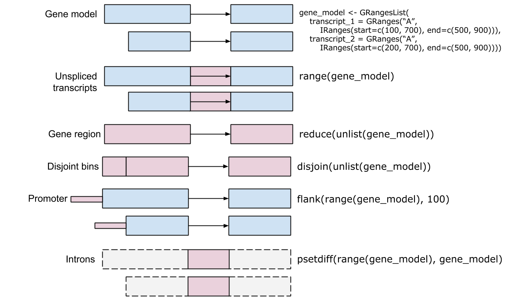
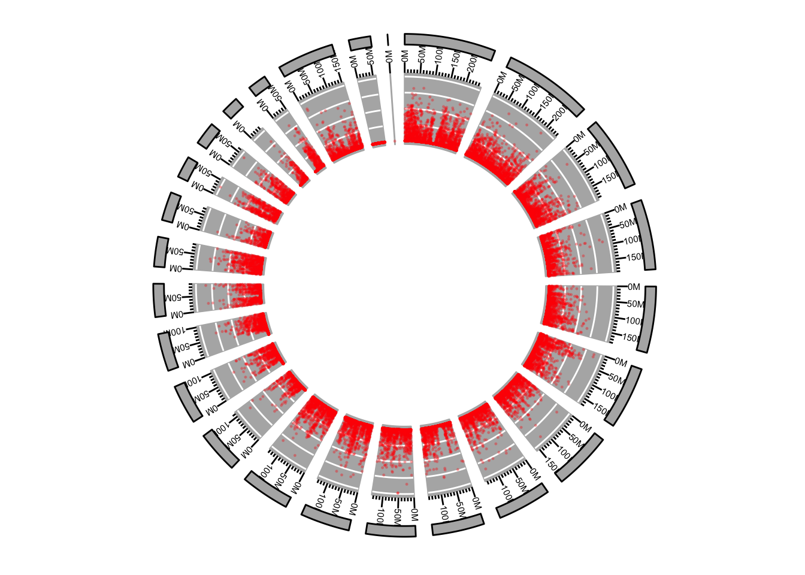
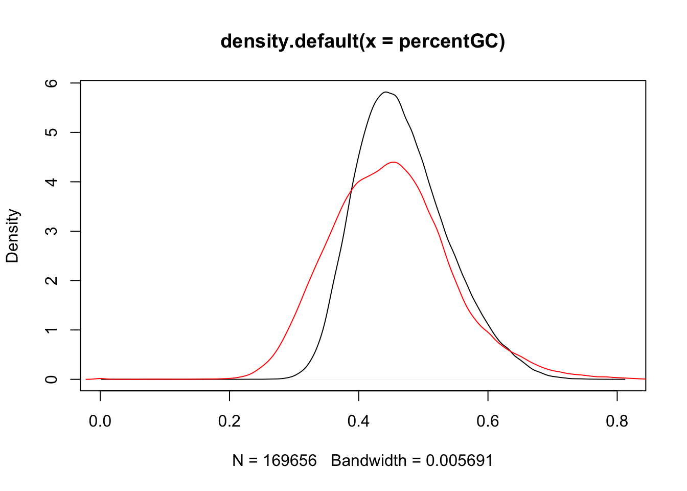

# _Bioconductor_ 'infrastructure' for sequence analysis


We will need to install a few bioconductor packages for this section.


```r
source('https://bioconductor.org/biocLite.R')
biocLite(c("GenomicAlignments",
           "BSgenome.Hsapiens.UCSC.hg19",
           "AnnotationHub",
           "TxDb.Hsapiens.BioMart.igis",
           "rtracklayer",
           "readr",
           "ComplexHeatmap",
           "ggbio"))
```

## Introduction

### Classes, methods, and packages

This section focuses on classes, methods, and packages, with the goal
being to learn to navigate the help system and interactive discovery
facilities.

### Motivation

Sequence analysis is specialized

- Large data needs to be processed in a memory- and time-efficient manner
- Specific algorithms have been developed for the unique
  characteristics of sequence data

Additional considerations

- Re-use of existing, tested code is easier to do and less error-prone
  than re-inventing the wheel.
- Interoperability between packages is easier when the packages share
  similar data structures.

Solution: use well-defined _classes_ to represent complex data;
_methods_ operate on the classes to perform useful functions.  Classes
and methods are placed together and distributed as _packages_ so that
we can all benefit from the hard work and tested code of others.

## Core packages

<pre>
                   VariantAnnotation
                           |
                           v
                    GenomicFeatures
                           |
                           v
                       BSgenome
                           |
                           v
                      rtracklayer
                           |
                           v
                    GenomicAlignments
                      |           |
                      v           v
     SummarizedExperiment   Rsamtools  ShortRead
                  |         |      |      |
                  v         v      v      v
                GenomicRanges     Biostrings
                        |          |
                        v          v
               GenomeInfoDb   (XVector)
                        |     |
                        v     v
                        IRanges
                           |
                           v 
                      (S4Vectors)
</pre>

## _IRanges_ and _GRanges_

The [IRanges][] package defines an important class for specifying
integer ranges, e.g.,

```r
library(IRanges)
ir <- IRanges(start=c(10, 20, 30), width=5)
ir
```

```
## IRanges object with 3 ranges and 0 metadata columns:
##           start       end     width
##       <integer> <integer> <integer>
##   [1]        10        14         5
##   [2]        20        24         5
##   [3]        30        34         5
```

There are many interesting operations to be performed on ranges, e.g,
`flank()` identifies adjacent ranges

```r
flank(ir, 3)
```

```
## IRanges object with 3 ranges and 0 metadata columns:
##           start       end     width
##       <integer> <integer> <integer>
##   [1]         7         9         3
##   [2]        17        19         3
##   [3]        27        29         3
```

The `IRanges` class is part of a class hierarchy. To see this, ask R for
the class of `ir`, and for the class definition of the `IRanges` class

```r
class(ir)
```

```
## [1] "IRanges"
## attr(,"package")
## [1] "IRanges"
```

```r
getClass(class(ir))
```

```
## Class "IRanges" [package "IRanges"]
## 
## Slots:
##                                                                                                 
## Name:              start             width             NAMES       elementType   elementMetadata
## Class:           integer           integer character_OR_NULL         character DataTable_OR_NULL
##                         
## Name:           metadata
## Class:              list
## 
## Extends: 
## Class "Ranges", directly
## Class "IntegerList", by class "Ranges", distance 2
## Class "RangesORmissing", by class "Ranges", distance 2
## Class "AtomicList", by class "Ranges", distance 3
## Class "List", by class "Ranges", distance 4
## Class "Vector", by class "Ranges", distance 5
## Class "Annotated", by class "Ranges", distance 6
## 
## Known Subclasses: "NormalIRanges", "GroupingIRanges"
```

Notice that `IRanges` extends the `Ranges` class. Show

Now try entering `?flank` (if not using _RStudio_, enter
`?"flank,<tab>"` where `<tab>` means to press the tab key to ask for
tab completion). You can see that there are help pages for `flank`
operating on several different classes. Select the completion


```r
?"flank,Ranges-method" 
```

and verify that you're at the page that describes the method relevant
to an `IRanges` instance.  Explore other range-based operations.

The [GenomicRanges][] package extends the notion of ranges to include
features relevant to application of ranges in sequence analysis,
particularly the ability to associate a range with a sequence name
(e.g., chromosome) and a strand. Create a `GRanges` instance based on
our `IRanges` instance, as follows

```r
library(GenomicRanges)
gr <- GRanges(c("chr1", "chr1", "chr2"), ir, strand=c("+", "-", "+"))
gr
```

```
## GRanges object with 3 ranges and 0 metadata columns:
##       seqnames    ranges strand
##          <Rle> <IRanges>  <Rle>
##   [1]     chr1  [10, 14]      +
##   [2]     chr1  [20, 24]      -
##   [3]     chr2  [30, 34]      +
##   -------
##   seqinfo: 2 sequences from an unspecified genome; no seqlengths
```

The notion of flanking sequence has a more nuanced meaning in
biology. In particular we might expect that flanking sequence on the
`+` strand would precede the range, but on the minus strand would
follow it. Verify that `flank` applied to a `GRanges` object has this
behavior.

```r
flank(gr, 3)
```

```
## GRanges object with 3 ranges and 0 metadata columns:
##       seqnames    ranges strand
##          <Rle> <IRanges>  <Rle>
##   [1]     chr1  [ 7,  9]      +
##   [2]     chr1  [25, 27]      -
##   [3]     chr2  [27, 29]      +
##   -------
##   seqinfo: 2 sequences from an unspecified genome; no seqlengths
```

Discover what classes `GRanges` extends, find the help page
documenting the behavior of `flank` when applied to a `GRanges` object,

It seems like there might be a number of helpful methods available for
working with genomic ranges; we can discover some of these from the
command line, indicating that the methods should be on the current
`search()` path


```r
methods(class="GRanges")
```

```
##   [1] !=                  [                   [<-                 %in%               
##   [5] <                   <=                  ==                  >                  
##   [9] >=                  $                   $<-                 aggregate          
##  [13] anyNA               append              as.character        as.complex         
##  [17] as.data.frame       as.env              as.factor           as.integer         
##  [21] as.list             as.logical          as.matrix           as.numeric         
##  [25] as.raw              BamViews            bamWhich<-          blocks             
##  [29] browseGenome        by                  c                   chrom              
##  [33] chrom<-             coerce              coerce<-            countOverlaps      
##  [37] coverage            disjoin             disjointBins        distance           
##  [41] distanceToNearest   duplicated          elementMetadata     elementMetadata<-  
##  [45] end                 end<-               eval                expand             
##  [49] expand.grid         export              extractROWS         extractUpstreamSeqs
##  [53] findOverlaps        flank               follow              gaps               
##  [57] getPromoterSeq      granges             head                intersect          
##  [61] is.na               is.unsorted         isDisjoint          length             
##  [65] lengths             liftOver            mapFromAlignments   mapFromTranscripts 
##  [69] mapToAlignments     mapToTranscripts    match               mcols              
##  [73] mcols<-             merge               metadata            metadata<-         
##  [77] mstack              names               names<-             narrow             
##  [81] nearest             NROW                Ops                 order              
##  [85] overlapsAny         parallelSlotNames   pcompare            pgap               
##  [89] pintersect          pmapFromAlignments  pmapFromTranscripts pmapToAlignments   
##  [93] pmapToTranscripts   precede             promoters           psetdiff           
##  [97] punion              range               ranges              ranges<-           
## [101] rank                reduce              relist              relistToClass      
## [105] rename              rep                 rep.int             replaceROWS        
## [109] resize              restrict            rev                 ROWNAMES           
## [113] rowRanges<-         ScanBamParam        ScanBcfParam        scanFa             
## [117] scanTabix           score               score<-             selfmatch          
## [121] seqinfo             seqinfo<-           seqlevelsInUse      seqnames           
## [125] seqnames<-          setdiff             setequal            shift              
## [129] shiftApply          show                showAsCell          slidingWindows     
## [133] sort                split               split<-             start              
## [137] start<-             strand              strand<-            subset             
## [141] subsetByOverlaps    summarizeOverlaps   summary             table              
## [145] tail                tapply              tile                transform          
## [149] trim                union               unique              update             
## [153] updateObject        values              values<-            width              
## [157] width<-             window              window<-            with               
## [161] xtabs              
## see '?methods' for accessing help and source code
```

Notice that the available `flank()` methods have been augmented by the
methods defined in the _GenomicRanges_ package, including those that are relevant (via inheritance) to the _GRanges_ class.


```r
grep("flank", methods(class="GRanges"), value=TRUE)
```

```
## [1] "flank,GenomicRanges-method"
```

Verify that the help page documents the behavior we just observed.


```r
?"flank,GenomicRanges-method"
```

Use `help()` to list the help pages in the `GenomicRanges` package,
and `vignettes()` to view and access available vignettes; these are
also available in the Rstudio 'Help' tab.

```r
help(package="GenomicRanges")
vignette(package="GenomicRanges")
vignette(package="GenomicRanges", "GenomicRangesHOWTOs")
```

### The `GRanges` and `GRangesList` classes

Aside: 'TxDb' packages provide an R representation of gene models


```r
library(TxDb.Hsapiens.UCSC.hg19.knownGene)
txdb <- TxDb.Hsapiens.UCSC.hg19.knownGene
```

`exons()`: _GRanges_


```r
exons(txdb)
```

```
## GRanges object with 289969 ranges and 1 metadata column:
##                  seqnames         ranges strand |   exon_id
##                     <Rle>      <IRanges>  <Rle> | <integer>
##        [1]           chr1 [11874, 12227]      + |         1
##        [2]           chr1 [12595, 12721]      + |         2
##        [3]           chr1 [12613, 12721]      + |         3
##        [4]           chr1 [12646, 12697]      + |         4
##        [5]           chr1 [13221, 14409]      + |         5
##        ...            ...            ...    ... .       ...
##   [289965] chrUn_gl000241 [35706, 35859]      - |    289965
##   [289966] chrUn_gl000241 [36711, 36875]      - |    289966
##   [289967] chrUn_gl000243 [11501, 11530]      + |    289967
##   [289968] chrUn_gl000243 [13608, 13637]      + |    289968
##   [289969] chrUn_gl000247 [ 5787,  5816]      - |    289969
##   -------
##   seqinfo: 93 sequences (1 circular) from hg19 genome
```


`exonsBy()`: _GRangesList_


```r
exonsBy(txdb, "tx")
```

```
## GRangesList object of length 82960:
## $1 
## GRanges object with 3 ranges and 3 metadata columns:
##       seqnames         ranges strand |   exon_id   exon_name exon_rank
##          <Rle>      <IRanges>  <Rle> | <integer> <character> <integer>
##   [1]     chr1 [11874, 12227]      + |         1        <NA>         1
##   [2]     chr1 [12613, 12721]      + |         3        <NA>         2
##   [3]     chr1 [13221, 14409]      + |         5        <NA>         3
## 
## $2 
## GRanges object with 3 ranges and 3 metadata columns:
##       seqnames         ranges strand | exon_id exon_name exon_rank
##   [1]     chr1 [11874, 12227]      + |       1      <NA>         1
##   [2]     chr1 [12595, 12721]      + |       2      <NA>         2
##   [3]     chr1 [13403, 14409]      + |       6      <NA>         3
## 
## $3 
## GRanges object with 3 ranges and 3 metadata columns:
##       seqnames         ranges strand | exon_id exon_name exon_rank
##   [1]     chr1 [11874, 12227]      + |       1      <NA>         1
##   [2]     chr1 [12646, 12697]      + |       4      <NA>         2
##   [3]     chr1 [13221, 14409]      + |       5      <NA>         3
## 
## ...
## <82957 more elements>
## -------
## seqinfo: 93 sequences (1 circular) from hg19 genome
```


_GRanges_ / _GRangesList_ are incredibly useful

- Represent **annotations** -- genes, variants, regulatory elements,
  copy number regions, ...
- Represent **data** -- aligned reads, ChIP peaks, called variants,
  ...

### Algebra of genomic ranges
  
Many biologically interesting questions represent operations on ranges

- Count overlaps between aligned reads and known genes --
  `GenomicRanges::summarizeOverlaps()`
- Genes nearest to regulatory regions -- `GenomicRanges::nearest()`,
  [ChIPseeker][]
- Called variants relevant to clinical phenotypes -- 
  [VariantFiltering][]

_GRanges_ Algebra

- Intra-range methods
    - Independent of other ranges in the same object
    - GRanges variants strand-aware
    - `shift()`, `narrow()`, `flank()`, `promoters()`, `resize()`,
      `restrict()`, `trim()`
    - See `?"intra-range-methods"`
- Inter-range methods
    - Depends on other ranges in the same object
    - `range()`, `reduce()`, `gaps()`, `disjoin()`
    - `coverage()` (!)
    - see `?"inter-range-methods"`
- Between-range methods
    - Functions of two (or more) range objects
    - `findOverlaps()`, `countOverlaps()`, ..., `%over%`, `%within%`,
      `%outside%`; `union()`, `intersect()`, `setdiff()`, `punion()`,
      `pintersect()`, `psetdiff()`



## _Biostrings_ (DNA or amino acid sequences)

Classes

- XString, XStringSet, e.g., DNAString (genomes),
  DNAStringSet (reads)

Methods --

- [Cheat sheat](http://bioconductor.org/packages/release/bioc/vignettes/Biostrings/inst/doc/BiostringsQuickOverview.pdf)
- Manipulation, e.g., `reverseComplement()`
- Summary, e.g., `letterFrequency()`
- Matching, e.g., `matchPDict()`, `matchPWM()`

Related packages

- [BSgenome][]
  - Whole-genome representations
  - Model and custom
- [ShortRead][]
  - FASTQ files

Example 

- Whole-genome sequences are distrubuted by ENSEMBL, NCBI, and others
  as FASTA files; model organism whole genome sequences are packaged
  into more user-friendly `BSgenome` packages. The following
  calculates GC content across chr14.

    
    ```r
    library(BSgenome.Hsapiens.UCSC.hg19)
    chr14_range = GRanges("chr14", IRanges(1, seqlengths(Hsapiens)["chr14"]))
    chr14_dna <- getSeq(Hsapiens, chr14_range)
    letterFrequency(chr14_dna, "GC", as.prob=TRUE)
    ```
    
    ```
    ##           G|C
    ## [1,] 0.336276
    ```
    
## Other formats and packages


Acknowledgements

- Core (Seattle): Sonali Arora, Marc Carlson, Nate Hayden, Jim Hester,
  Valerie Obenchain, Herv&eacute; Pag&egrave;s, Paul Shannon, Dan
  Tenenbaum.

- The research reported in this presentation was supported by the
  National Cancer Institute and the National Human Genome Research
  Institute of the National Institutes of Health under Award numbers
  U24CA180996 and U41HG004059, and the National Science Foundation
  under Award number 1247813. The content is solely the responsibility
  of the authors and does not necessarily represent the official views
  of the National Institutes of Health or the National Science
  Foundation.


[AnnotationDbi]: http://bioconductor.org/packages/AnnotationDbi
[BSgenome]: http://bioconductor.org/packages/BSgenome
[BiocParallel]: http://bioconductor.org/packages/BiocParallel
[Biostrings]: http://bioconductor.org/packages/Biostrings
[CNTools]: http://bioconductor.org/packages/CNTools
[ChIPQC]: http://bioconductor.org/packages/ChIPQC
[ChIPpeakAnno]: http://bioconductor.org/packages/ChIPpeakAnno
[DESeq2]: http://bioconductor.org/packages/DESeq2
[DiffBind]: http://bioconductor.org/packages/DiffBind
[GenomicAlignments]: http://bioconductor.org/packages/GenomicAlignments
[GenomicRanges]: http://bioconductor.org/packages/GenomicRanges
[IRanges]: http://bioconductor.org/packages/IRanges
[KEGGREST]: http://bioconductor.org/packages/KEGGREST
[PSICQUIC]: http://bioconductor.org/packages/PSICQUIC
[rtracklayer]: http://bioconductor.org/packages/rtracklayer
[Rsamtools]: http://bioconductor.org/packages/Rsamtools
[ShortRead]: http://bioconductor.org/packages/ShortRead
[VariantAnnotation]: http://bioconductor.org/packages/VariantAnnotation
[VariantFiltering]: http://bioconductor.org/packages/VariantFiltering
[VariantTools]: http://bioconductor.org/packages/VariantTools
[biomaRt]: http://bioconductor.org/packages/biomaRt
[cn.mops]: http://bioconductor.org/packages/cn.mops
[h5vc]: http://bioconductor.org/packages/h5vc
[edgeR]: http://bioconductor.org/packages/edgeR
[ensemblVEP]: http://bioconductor.org/packages/ensemblVEP
[limma]: http://bioconductor.org/packages/limma
[metagenomeSeq]: http://bioconductor.org/packages/metagenomeSeq
[phyloseq]: http://bioconductor.org/packages/phyloseq
[snpStats]: http://bioconductor.org/packages/snpStats

[org.Hs.eg.db]: http://bioconductor.org/packages/org.Hs.eg.db
[TxDb.Hsapiens.UCSC.hg19.knownGene]: http://bioconductor.org/packages/TxDb.Hsapiens.UCSC.hg19.knownGene
[BSgenome.Hsapiens.UCSC.hg19]: http://bioconductor.org/packages/BSgenome.Hsapiens.UCSC.hg19


## Public Data and Annotation from _AnnotationHub_

### Roadmap Epigenomics Project 

All Roadmap Epigenomics files are hosted
[here](http://egg2.wustl.edu/roadmap/data/byFileType/). If one had to
download these files on their own, one would navigate through the web
interface to find useful files, then use something like the following
_R_ code.


```r
url <- "http://egg2.wustl.edu/roadmap/data/byFileType/peaks/consolidated/broadPeak/E001-H3K4me1.broadPeak.gz"
filename <-  basename(url)
download.file(url, destfile=filename)
if (file.exists(filename))
   data <- import(filename, format="bed")
```
This would have to be repeated for all files, and the onus would lie
on the user to identify, download, import, and manage the local disk
location of these files.

AnnotationHub reduces this task to just a few lines of _R_ code 

```r
library(AnnotationHub)
```

```
## Loading required package: BiocGenerics
```

```
## Loading required package: methods
```

```
## Loading required package: parallel
```

```
## 
## Attaching package: 'BiocGenerics'
```

```
## The following objects are masked from 'package:parallel':
## 
##     clusterApply, clusterApplyLB, clusterCall, clusterEvalQ, clusterExport, clusterMap,
##     parApply, parCapply, parLapply, parLapplyLB, parRapply, parSapply, parSapplyLB
```

```
## The following objects are masked from 'package:stats':
## 
##     IQR, mad, sd, var, xtabs
```

```
## The following objects are masked from 'package:base':
## 
##     anyDuplicated, append, as.data.frame, cbind, colMeans, colnames, colSums, do.call,
##     duplicated, eval, evalq, Filter, Find, get, grep, grepl, intersect, is.unsorted,
##     lapply, lengths, Map, mapply, match, mget, order, paste, pmax, pmax.int, pmin,
##     pmin.int, Position, rank, rbind, Reduce, rowMeans, rownames, rowSums, sapply,
##     setdiff, sort, table, tapply, union, unique, unsplit, which, which.max, which.min
```

```r
ah = AnnotationHub()
```

```
## snapshotDate(): 2017-04-24
```

```r
epiFiles <- query(ah, "EpigenomeRoadMap")
```
A look at the value returned by `epiFiles` shows us that 
18248 roadmap resources are available via 
AnnotationHub.  Additional information about 
the files is also available, e.g., where the files came from
(dataprovider), genome, species, sourceurl, sourcetypes.


```r
epiFiles
```

```
## AnnotationHub with 18248 records
## # snapshotDate(): 2017-04-24 
## # $dataprovider: BroadInstitute
## # $species: Homo sapiens
## # $rdataclass: BigWigFile, GRanges, data.frame
## # additional mcols(): taxonomyid, genome, description, coordinate_1_based, maintainer,
## #   rdatadateadded, preparerclass, tags, rdatapath, sourceurl, sourcetype 
## # retrieve records with, e.g., 'object[["AH28856"]]' 
## 
##             title                                 
##   AH28856 | E001-H3K4me1.broadPeak.gz             
##   AH28857 | E001-H3K4me3.broadPeak.gz             
##   AH28858 | E001-H3K9ac.broadPeak.gz              
##   AH28859 | E001-H3K9me3.broadPeak.gz             
##   AH28860 | E001-H3K27me3.broadPeak.gz            
##   ...       ...                                   
##   AH49540 | E058_mCRF_FractionalMethylation.bigwig
##   AH49541 | E059_mCRF_FractionalMethylation.bigwig
##   AH49542 | E061_mCRF_FractionalMethylation.bigwig
##   AH49543 | E081_mCRF_FractionalMethylation.bigwig
##   AH49544 | E082_mCRF_FractionalMethylation.bigwig
```

A good sanity check to ensure that we have files only from the Roadmap Epigenomics
project is to check that all the files in the returned smaller hub object
come from _Homo sapiens_ and the hg19 genome 

```r
unique(epiFiles$species)
```

```
## [1] "Homo sapiens"
```

```r
unique(epiFiles$genome)
```

```
## [1] "hg19"
```
Broadly, one can get an idea of the different files from this project 
looking at the sourcetype

```r
table(epiFiles$sourcetype)
```

```
## 
##    BED BigWig    GTF    tab    Zip 
##   8298   9932      3      1     14
```
To get a more descriptive idea of these different files one can use:

```r
head(sort(table(epiFiles$description), decreasing=TRUE))
```

```
## 
## Bigwig File containing -log10(p-value) signal tracks from EpigenomeRoadMap Project 
##                                                                               6881 
## Bigwig File containing fold enrichment signal tracks from EpigenomeRoadMap Project 
##                                                                               2947 
##    Narrow ChIP-seq peaks for consolidated epigenomes from EpigenomeRoadMap Project 
##                                                                               2894 
##     Broad ChIP-seq peaks for consolidated epigenomes from EpigenomeRoadMap Project 
##                                                                               2534 
##    Gapped ChIP-seq peaks for consolidated epigenomes from EpigenomeRoadMap Project 
##                                                                               2534 
##        Narrow DNasePeaks for consolidated epigenomes from EpigenomeRoadMap Project 
##                                                                                131
```

The 'metadata' provided by the Roadmap Epigenomics Project is also
available. Note that the information displayed about a hub with a
single resource is quite different from the information displayed when
the hub references more than one resource.

```r
metadata.tab <- query(ah , c("EpigenomeRoadMap", "Metadata"))
metadata.tab
```

```
## AnnotationHub with 1 record
## # snapshotDate(): 2017-04-24 
## # names(): AH41830
## # $dataprovider: BroadInstitute
## # $species: Homo sapiens
## # $rdataclass: data.frame
## # $title: EID_metadata.tab
## # $description: Metadata for EpigenomeRoadMap Project
## # $taxonomyid: 9606
## # $genome: hg19
## # $sourcetype: tab
## # $sourceurl: http://egg2.wustl.edu/roadmap/data/byFileType/metadata/EID_metadata.tab
## # $sourcelastmodifieddate: 2015-02-15
## # $sourcesize: 18035
## # $tags: c("EpigenomeRoadMap", "Metadata") 
## # retrieve record with 'object[["AH41830"]]'
```

So far we have been exploring information about resources, without
downloading the resource to a local cache and importing it into R.
One can retrieve the resource using `[[` as indicated at the
end of the show method


```
## loading from cache '/Users/sdavis2//.AnnotationHub/47270'
```


```r
metadata.tab <- ah[["AH41830"]]
```

```
## loading from cache '/Users/sdavis2//.AnnotationHub/47270'
```

The metadata.tab file is returned as a _data.frame_. The first 6 rows
of the first 5 columns are shown here:


```r
metadata.tab[1:6, 1:5]
```

```
##    EID    GROUP   COLOR          MNEMONIC                                   STD_NAME
## 1 E001      ESC #924965            ESC.I3                                ES-I3 Cells
## 2 E002      ESC #924965           ESC.WA7                               ES-WA7 Cells
## 3 E003      ESC #924965            ESC.H1                                   H1 Cells
## 4 E004 ES-deriv #4178AE ESDR.H1.BMP4.MESO H1 BMP4 Derived Mesendoderm Cultured Cells
## 5 E005 ES-deriv #4178AE ESDR.H1.BMP4.TROP H1 BMP4 Derived Trophoblast Cultured Cells
## 6 E006 ES-deriv #4178AE       ESDR.H1.MSC          H1 Derived Mesenchymal Stem Cells
```

One can keep constructing different queries using multiple arguments to 
trim down these 18248 to get the files one wants. 
For example, to get the ChIP-Seq files for consolidated epigenomes, 
one could use


```r
bpChipEpi <- query(ah , c("EpigenomeRoadMap", "broadPeak", "chip", "consolidated"))
```
To get all the bigWig signal files, one can query the hub using 


```r
allBigWigFiles <- query(ah, c("EpigenomeRoadMap", "BigWig"))
```
To access the 15 state chromatin segmentations, one can use


```r
seg <- query(ah, c("EpigenomeRoadMap", "segmentations"))
```
If one is interested in getting all the files related to one sample


```r
E126 <- query(ah , c("EpigenomeRoadMap", "E126", "H3K4ME2"))
E126
```

```
## AnnotationHub with 6 records
## # snapshotDate(): 2017-04-24 
## # $dataprovider: BroadInstitute
## # $species: Homo sapiens
## # $rdataclass: BigWigFile, GRanges
## # additional mcols(): taxonomyid, genome, description, coordinate_1_based, maintainer,
## #   rdatadateadded, preparerclass, tags, rdatapath, sourceurl, sourcetype 
## # retrieve records with, e.g., 'object[["AH29817"]]' 
## 
##             title                                  
##   AH29817 | E126-H3K4me2.broadPeak.gz              
##   AH30868 | E126-H3K4me2.narrowPeak.gz             
##   AH31801 | E126-H3K4me2.gappedPeak.gz             
##   AH32990 | E126-H3K4me2.fc.signal.bigwig          
##   AH34022 | E126-H3K4me2.pval.signal.bigwig        
##   AH40177 | E126-H3K4me2.imputed.pval.signal.bigwig
```

Hub resources can also be selected using `$`, `subset()`, and
`display()`; see the main
[_AnnotationHub_ vignette](AnnotationHub.html) for additional detail.

Hub resources are imported as the appropriate _Bioconductor_ object
for use in further analysis.  For example, peak files are returned as
_GRanges_ objects.


```
## loading from cache '/Users/sdavis2//.AnnotationHub/35257'
```


```r
peaks <- E126[['AH29817']]
```

```
## loading from cache '/Users/sdavis2//.AnnotationHub/35257'
```

```r
seqinfo(peaks)
```

```
## Seqinfo object with 93 sequences (1 circular) from hg19 genome:
##   seqnames       seqlengths isCircular genome
##   chr1            249250621      FALSE   hg19
##   chr2            243199373      FALSE   hg19
##   chr3            198022430      FALSE   hg19
##   chr4            191154276      FALSE   hg19
##   chr5            180915260      FALSE   hg19
##   ...                   ...        ...    ...
##   chrUn_gl000245      36651      FALSE   hg19
##   chrUn_gl000246      38154      FALSE   hg19
##   chrUn_gl000247      36422      FALSE   hg19
##   chrUn_gl000248      39786      FALSE   hg19
##   chrUn_gl000249      38502      FALSE   hg19
```

BigWig files are returned as _BigWigFile_ objects. A _BigWigFile_ is a
reference to a file on disk; the data in the file can be read in using
`rtracklayer::import()`, perhaps querying these large files for
particular genomic regions of interest as described on the help page
`?import.bw`.

Each record inside AnnotationHub is associated with a
unique identifier. Most _GRanges_ objects returned by 
AnnotationHub contain the unique AnnotationHub identifier of
the resource from which the _GRanges_ is derived.  This can come handy
when working with the _GRanges_ object for a while, and additional
information about the object (e.g., the name of the file in the cache,
or the original sourceurl for the data underlying the resource) that
is being worked with.


```r
metadata(peaks)
```

```
## $AnnotationHubName
## [1] "AH29817"
## 
## $`File Name`
## [1] "E126-H3K4me2.broadPeak.gz"
## 
## $`Data Source`
## [1] "http://egg2.wustl.edu/roadmap/data/byFileType/peaks/consolidated/broadPeak/E126-H3K4me2.broadPeak.gz"
## 
## $Provider
## [1] "BroadInstitute"
## 
## $Organism
## [1] "Homo sapiens"
## 
## $`Taxonomy ID`
## [1] 9606
```

```r
ah[metadata(peaks)$AnnotationHubName]$sourceurl
```

```
## [1] "http://egg2.wustl.edu/roadmap/data/byFileType/peaks/consolidated/broadPeak/E126-H3K4me2.broadPeak.gz"
```

### Ensembl GTF TxDb gene models

_Bioconductor_ represents gene models using 'transcript'
databases. These are available via packages such as
_TxDb.Hsapiens.UCSC.hg38.knownGene_
or can be constructed using functions such as
`GenomicFeatures::makeTxDbFromBiomart()`.

_AnnotationHub_ provides an easy way to work with gene models
published by Ensembl. We are going to be working with human data
that are mapped to GRCh37 (hg19). We have a choice of providers (UCSC,
NCBI, Ensembl), but we will just choose Ensembl here to minimize the
amount of ID changing.


```r
query(ah,c('gtf','ensembl','sapiens','GRCh37'))
```

```
## AnnotationHub with 7 records
## # snapshotDate(): 2017-04-24 
## # $dataprovider: Ensembl
## # $species: Homo sapiens
## # $rdataclass: GRanges
## # additional mcols(): taxonomyid, genome, description, coordinate_1_based, maintainer,
## #   rdatadateadded, preparerclass, tags, rdatapath, sourceurl, sourcetype 
## # retrieve records with, e.g., 'object[["AH7558"]]' 
## 
##             title                     
##   AH7558  | Homo_sapiens.GRCh37.70.gtf
##   AH7619  | Homo_sapiens.GRCh37.69.gtf
##   AH7666  | Homo_sapiens.GRCh37.71.gtf
##   AH7726  | Homo_sapiens.GRCh37.72.gtf
##   AH7790  | Homo_sapiens.GRCh37.73.gtf
##   AH8753  | Homo_sapiens.GRCh37.74.gtf
##   AH10684 | Homo_sapiens.GRCh37.75.gtf
```

We see that there is a GTF file describing gene models.
The GTF file is imported as a _GRanges_ instance, but with a number of
columns that allow the _Granges_ object to encode the complexity of
exons, CDS, and utrs.  


```r
gtf <- ah[['AH10684']]
```

```
## loading from cache '/Users/sdavis2//.AnnotationHub/10684'
```

```
## using guess work to populate seqinfo
```

```r
head(gtf, 3)
```

```
## GRanges object with 3 ranges and 16 metadata columns:
##       seqnames         ranges strand |               source       type     score     phase
##          <Rle>      <IRanges>  <Rle> |             <factor>   <factor> <numeric> <integer>
##   [1]        1 [11869, 14412]      + |           pseudogene       gene      <NA>      <NA>
##   [2]        1 [11869, 14409]      + | processed_transcript transcript      <NA>      <NA>
##   [3]        1 [11869, 12227]      + | processed_transcript       exon      <NA>      <NA>
##               gene_id   gene_name    gene_source gene_biotype   transcript_id transcript_name
##           <character> <character>    <character>  <character>     <character>     <character>
##   [1] ENSG00000223972     DDX11L1 ensembl_havana   pseudogene            <NA>            <NA>
##   [2] ENSG00000223972     DDX11L1 ensembl_havana   pseudogene ENST00000456328     DDX11L1-002
##   [3] ENSG00000223972     DDX11L1 ensembl_havana   pseudogene ENST00000456328     DDX11L1-002
##       transcript_source exon_number         exon_id         tag     ccds_id  protein_id
##             <character>   <numeric>     <character> <character> <character> <character>
##   [1]              <NA>        <NA>            <NA>        <NA>        <NA>        <NA>
##   [2]            havana        <NA>            <NA>        <NA>        <NA>        <NA>
##   [3]            havana           1 ENSE00002234944        <NA>        <NA>        <NA>
##   -------
##   seqinfo: 265 sequences (1 circular) from GRCh37 genome
```

It is trivial to make a transcript database, or _TxDb_, instance of
these data. We will use this _TxDb_ to quickly access gene annotation
in genome context. 


```r
library(GenomicFeatures)         # for makeTxDbFromGRanges
```

```
## Loading required package: S4Vectors
```

```
## Loading required package: stats4
```

```
## 
## Attaching package: 'S4Vectors'
```

```
## The following object is masked from 'package:base':
## 
##     expand.grid
```

```
## Loading required package: IRanges
```

```
## Loading required package: GenomeInfoDb
```

```
## Loading required package: GenomicRanges
```

```
## Loading required package: AnnotationDbi
```

```
## Loading required package: Biobase
```

```
## Welcome to Bioconductor
## 
##     Vignettes contain introductory material; view with 'browseVignettes()'. To cite
##     Bioconductor, see 'citation("Biobase")', and for packages 'citation("pkgname")'.
```

```
## 
## Attaching package: 'Biobase'
```

```
## The following object is masked from 'package:AnnotationHub':
## 
##     cache
```

```r
txdb <- makeTxDbFromGRanges(gtf)
```

## Epigenomics case study

We are going to use data from the
[ENCODE project](https://www.genome.gov/10005107/)
as  a playground for using the Bioconductor ranges infrastructure. To
keep things manageable, we will focus on only the K562 leukemia cell
line and on histone marks. To keep the data smallish, but without loss
of generality, we will use data that have been processed using a
peak-caller and summarized as regions of statistically significant
regions.

Bioconductor has processed all of the ENCODE data into Bioconductor
data structures and then stored and made available via the
AnnotationHub system we saw above. 


```r
query(ah,c('K562','h3k','E123','narrow'))
```

```
## AnnotationHub with 10 records
## # snapshotDate(): 2017-04-24 
## # $dataprovider: BroadInstitute
## # $species: Homo sapiens
## # $rdataclass: GRanges
## # additional mcols(): taxonomyid, genome, description, coordinate_1_based, maintainer,
## #   rdatadateadded, preparerclass, tags, rdatapath, sourceurl, sourcetype 
## # retrieve records with, e.g., 'object[["AH30830"]]' 
## 
##             title                      
##   AH30830 | E123-H3K4me1.narrowPeak.gz 
##   AH30831 | E123-H3K4me2.narrowPeak.gz 
##   AH30832 | E123-H3K4me3.narrowPeak.gz 
##   AH30833 | E123-H3K9ac.narrowPeak.gz  
##   AH30834 | E123-H3K9me1.narrowPeak.gz 
##   AH30835 | E123-H3K9me3.narrowPeak.gz 
##   AH30836 | E123-H3K27ac.narrowPeak.gz 
##   AH30837 | E123-H3K27me3.narrowPeak.gz
##   AH30838 | E123-H3K36me3.narrowPeak.gz
##   AH30839 | E123-H3K79me2.narrowPeak.gz
```

```r
histoneSets = names(query(ah,c('K562','E123','h3k','narrow')))
```


```r
histonePeaks = ah[[histoneSets[1]]]
```

```
## loading from cache '/Users/sdavis2//.AnnotationHub/36270'
```


```r
si = seqinfo(pro)
fullchroms = GRanges(seqnames=seqnames(si),
                     ranges=IRanges(start=rep(1,length(si)),
                                    end  =seqlengths(si)))
seqinfo(fullchroms) = seqinfo(pro)
# 1MB bins
tile0.1mb = unlist(tile(fullchroms,width=1e5))
seqinfo(tile0.1mb) = seqinfo(pro)
tile0.1mb = keepStandardChromosomes(tile0.1mb,pruning.mode = 'coarse')
histonePeaks = keepStandardChromosomes(histonePeaks,pruning.mode = 'coarse')
seqlevelsStyle(tile0.1mb) = seqlevelsStyle(histonePeaks)
histonePeaks=dropSeqlevels(histonePeaks,'chrM')
genome(tile0.1mb) = 'hg19'
```


```r
tile0.1mb$peakCount = countOverlaps(tile0.1mb,histonePeaks)
```


```r
library(ggbio)
p = ggbio() + circle(tile0.1mb,geom='point', aes(y = peakCount),
                     color='red', alpha=0.25, size=0.25, grid=TRUE,
                     radius=60, trackWidth=30) +
    circle(tile0.1mb, geom = "scale", size = 2,radius=90) +
    circle(tile0.1mb, geom='ideo',fill='gray70')
p
```




```r
hpList = sapply(histoneSets,function(ahname) ah[[ahname]])
# get the "titles" for the experiment
# And cleanup the messy names
hptitles = gsub('E123-|\\.narrowPeak\\.gz','',ah[histoneSets]$title)
names(hpList) = hptitles
```

 [1] "H3K4me1"  "H3K4me2"  "H3K4me3"  "H3K9ac"   "H3K9me1"  "H3K9me3" 
 [7] "H3K27ac"  "H3K27me3" "H3K36me3" "H3K79me2"


Jaccard Similarity

 $$ J(A,B) = \frac{\left | A \bigcap B \right |}{\left | A \bigcup B \right |} $$

Jaccard Distance

 $$ d_J(A,B) = 1 - J(A,B) = 1 - \frac{\left | A \bigcap B \right |}{\left | A \bigcup B \right |} $$


```r
regionJaccard = function(a,b) {
    sum(width(intersect(a,b)))/sum(width(union(a,b)))
}

multiJaccard <- function(a,b, fun) {
    res <- matrix(0L, length(a), length(b))
    for (i in seq_along(a))
    {
       for (j in seq_along(b))
       {
          res[i,j] = fun(a[[i]],b[[j]])
       }
    }
    if(!is.null(names(a))) rownames(res) = names(a)
    if(!is.null(names(b))) colnames(res) = names(b)
    
    res
}
```


```r
res = multiJaccard(hpList,hpList,regionJaccard)
```


```r
library(ComplexHeatmap)
```

```
## Loading required package: grid
```

```
## 
## Attaching package: 'ComplexHeatmap'
```

```
## The following object is masked from 'package:plotly':
## 
##     add_heatmap
```

```r
annot = data.frame(exprStatus=c('Active','Active','Active','Active',
                                'Active','Repressed','Active','Repressed',NA,'Active'),
                   locale=c(NA,NA,'Promoter','Promoter',NA,'Body','Enhancer','Body','Body',NA),
                   row.names=hptitles)
Heatmap(res,top_annotation=HeatmapAnnotation(
          df=annot,col=list(exprStatus=c('Active'='yellow',Repressed='blue'))))
```




```r
library(readr)
k562expr = read_tsv('https://www.encodeproject.org/files/ENCFF812ADD/@@download/ENCFF812ADD.tsv')
```

```
## Parsed with column specification:
## cols(
##   gene_id = col_character(),
##   `transcript_id(s)` = col_character(),
##   length = col_double(),
##   effective_length = col_double(),
##   expected_count = col_double(),
##   TPM = col_double(),
##   FPKM = col_double(),
##   posterior_mean_count = col_double(),
##   posterior_standard_deviation_of_count = col_double(),
##   pme_TPM = col_double(),
##   pme_FPKM = col_double(),
##   TPM_ci_lower_bound = col_double(),
##   TPM_ci_upper_bound = col_double(),
##   FPKM_ci_lower_bound = col_double(),
##   FPKM_ci_upper_bound = col_double()
## )
```

```r
head(k562expr)
```

```
## # A tibble: 6 x 15
##   gene_id `transcript_id(s)` length effective_length expected_count   TPM  FPKM
##     <chr>              <chr>  <dbl>            <dbl>          <dbl> <dbl> <dbl>
## 1   10904              10904     93               60           0.00  0.00  0.00
## 2   12954              12954     94               61           0.00  0.00  0.00
## 3   12956              12956     72               39           0.00  0.00  0.00
## 4   12958              12958     82               49          22.22 18.58 17.10
## 5   12960              12960     73               40           0.00  0.00  0.00
## 6   12962              12962     72               39           1.00  1.05  0.96
## # ... with 8 more variables: posterior_mean_count <dbl>,
## #   posterior_standard_deviation_of_count <dbl>, pme_TPM <dbl>, pme_FPKM <dbl>,
## #   TPM_ci_lower_bound <dbl>, TPM_ci_upper_bound <dbl>, FPKM_ci_lower_bound <dbl>,
## #   FPKM_ci_upper_bound <dbl>
```

These data have several columns of values, including `tpm` or
transcripts-per-million, which we be using as our measure of
expression. Go ahead and take a look at the distribution and other
characteristics of the `tpm` column.


```r
# Fix gene names
k562expr$gene_id=sub('\\..*','',k562expr$gene_id)
k562expr = subset(k562expr,grepl('ENSG',gene_id))
```


```r
pro = promoters(txdb, upstream = 1000, downstream = 1000,
                columns = c('tx_name','gene_id'))
```


```r
pro$TPM = k562expr$TPM[match(unlist(pro$gene_id),k562expr$gene_id)]
pro$logTPM =
    log10(k562expr$TPM[match(unlist(pro$gene_id),k562expr$gene_id)])
head(pro)
```

```
## GRanges object with 6 ranges and 4 metadata columns:
##       seqnames         ranges strand |         tx_name         gene_id       TPM     logTPM
##          <Rle>      <IRanges>  <Rle> |     <character> <CharacterList> <numeric>  <numeric>
##   [1]        1 [10869, 12868]      + | ENST00000456328 ENSG00000223972      0.39 -0.4089354
##   [2]        1 [10872, 12871]      + | ENST00000515242 ENSG00000223972      0.39 -0.4089354
##   [3]        1 [10874, 12873]      + | ENST00000518655 ENSG00000223972      0.39 -0.4089354
##   [4]        1 [11010, 13009]      + | ENST00000450305 ENSG00000223972      0.39 -0.4089354
##   [5]        1 [28554, 30553]      + | ENST00000473358 ENSG00000243485      0.38 -0.4202164
##   [6]        1 [29267, 31266]      + | ENST00000469289 ENSG00000243485      0.38 -0.4202164
##   -------
##   seqinfo: 265 sequences (1 circular) from GRCh37 genome
```


## `sessionInfo()`


```r
sessionInfo()
```

```
## R Under development (unstable) (2016-10-26 r71594)
## Platform: x86_64-apple-darwin13.4.0 (64-bit)
## Running under: macOS Sierra 10.12.4
## 
## locale:
## [1] en_US.UTF-8/en_US.UTF-8/en_US.UTF-8/C/en_US.UTF-8/en_US.UTF-8
## 
## attached base packages:
## [1] stats4    parallel  stats     graphics  grDevices utils     datasets  methods   base     
## 
## other attached packages:
##  [1] TxDb.Hsapiens.UCSC.hg19.knownGene_3.2.2 GenomicAlignments_1.11.11              
##  [3] Rsamtools_1.27.13                       SummarizedExperiment_1.5.9             
##  [5] DelayedArray_0.1.11                     matrixStats_0.52.2                     
##  [7] GenomicFeatures_1.27.9                  AnnotationDbi_1.37.4                   
##  [9] Biobase_2.35.1                          readr_1.1.1                            
## [11] BSgenome.Hsapiens.UCSC.hg19_1.4.0       BSgenome_1.43.7                        
## [13] Biostrings_2.43.8                       XVector_0.15.2                         
## [15] rtracklayer_1.35.6                      GenomicRanges_1.27.23                  
## [17] GenomeInfoDb_1.11.11                    IRanges_2.9.19                         
## [19] S4Vectors_0.13.17                       shiny_1.0.1                            
## [21] AnnotationHub_2.7.14                    BiocGenerics_0.21.3                    
## [23] plotly_4.7.0                            ggplot2_2.2.1.9000                     
## 
## loaded via a namespace (and not attached):
##  [1] httr_1.2.1                    tidyr_0.6.1                   jsonlite_1.4                 
##  [4] viridisLite_0.2.0             assertthat_0.2.0              interactiveDisplayBase_1.13.0
##  [7] GenomeInfoDbData_0.99.0       yaml_2.1.14                   RSQLite_1.1-2                
## [10] backports_1.0.5               lattice_0.20-35               glue_1.1.1                   
## [13] digest_0.6.12                 colorspace_1.3-2              htmltools_0.3.5              
## [16] httpuv_1.3.3                  Matrix_1.2-8                  plyr_1.8.4                   
## [19] XML_3.98-1.6                  pkgconfig_2.0.1               biomaRt_2.32.1               
## [22] bookdown_0.4.1                zlibbioc_1.21.0               purrr_0.2.2                  
## [25] xtable_1.8-2                  scales_0.4.1                  BiocParallel_1.9.6           
## [28] tibble_1.3.3                  lazyeval_0.2.0                magrittr_1.5                 
## [31] mime_0.5                      memoise_1.1.0                 evaluate_0.10                
## [34] BiocInstaller_1.26.0          tools_3.4.0                   data.table_1.10.4            
## [37] hms_0.3                       stringr_1.2.0                 munsell_0.4.3                
## [40] bindrcpp_0.2                  compiler_3.4.0                rlang_0.1.1                  
## [43] grid_3.4.0                    RCurl_1.95-4.8                htmlwidgets_0.8              
## [46] crosstalk_1.0.0               bitops_1.0-6                  labeling_0.3                 
## [49] rmarkdown_1.4                 codetools_0.2-15              gtable_0.2.0                 
## [52] DBI_0.6-1                     curl_2.5                      R6_2.2.0                     
## [55] knitr_1.16                    dplyr_0.7.1                   bindr_0.1                    
## [58] rprojroot_1.2                 stringi_1.1.5                 Rcpp_0.12.11
```
